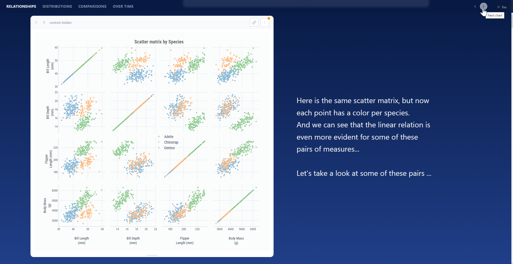
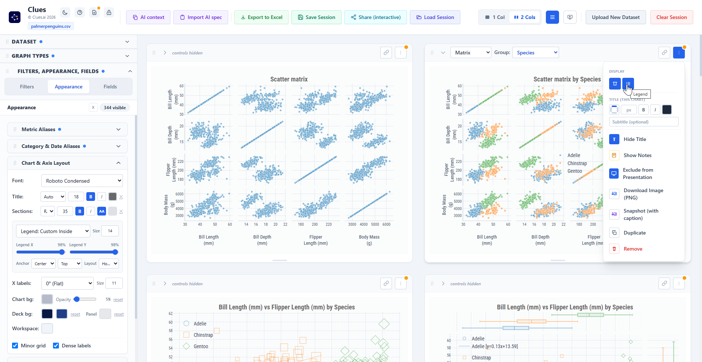
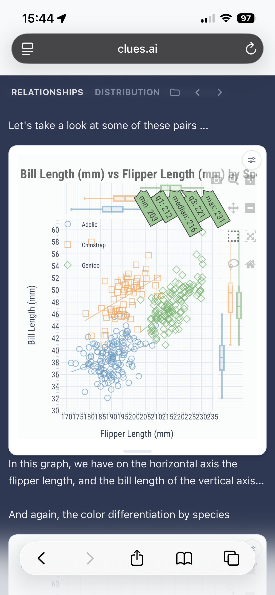

# Clues - Version Log

Short notes on what's new. The full manual is the [User Guide](USER_GUIDE.md).

## 2026-07-08

- **Presentation view vs Workspace view.** Chart sizes, placed notes, and the deck background now live on the "stage" - the 1-column layout with the side panel hidden, and Present mode. The everyday dashboard stays compact and neutral, and each view remembers its own chart heights. Nothing is ever reset by switching.

  | Presentation view | Workspace view |
  | --- | --- |
  |  |  |
- **Deck background gradient.** The presentation background takes an optional second color for a top-to-bottom gradient; the workspace keeps its own separate color.
- **Much faster on phones.** The site ships precompiled, repeat visits load from cache (and work offline), and charts build as they scroll into view.
- **Phone playback polish.** Presentation notes read as captions under their chart, a small per-chart button summons the controls, and a folder button in the presentation bar opens another shared `.clue`.

  

- **Bigger labels** on sunburst and treemap charts.
- **Fixes:** the note position buttons re-anchor a dragged note; the 3D auto-orbit no longer stalls; shared decks no longer show a spurious "different version" warning.

## 2026-07-07

- **Present mode.** One click turns the workspace into a full-window interactive deck: a frozen section menu with scroll highlighting, chart-by-chart arrows, and a per-chart *Include / Exclude from Presentation* toggle - build many, present few.
- **Presentation notes.** Free-standing rich text beside any chart - fonts, sizes, colors, alignment, and drag-to-place, left, right, above, or below.
- **Free chart placement.** Width, height, and horizontal position per chart, with snap-to-align guides.
- **AI styling, complete.** Spec 1.3 covers the whole look in 30 operations; *Copy current styling* exports your theme as a paste-anywhere spec.
- **Sharing to phones.** Send the `.clue`, open it at clues.ai - it plays straight into the presentation.
