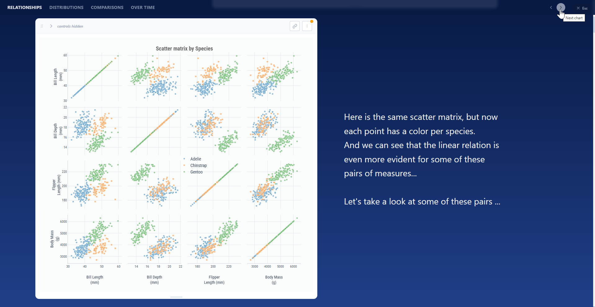
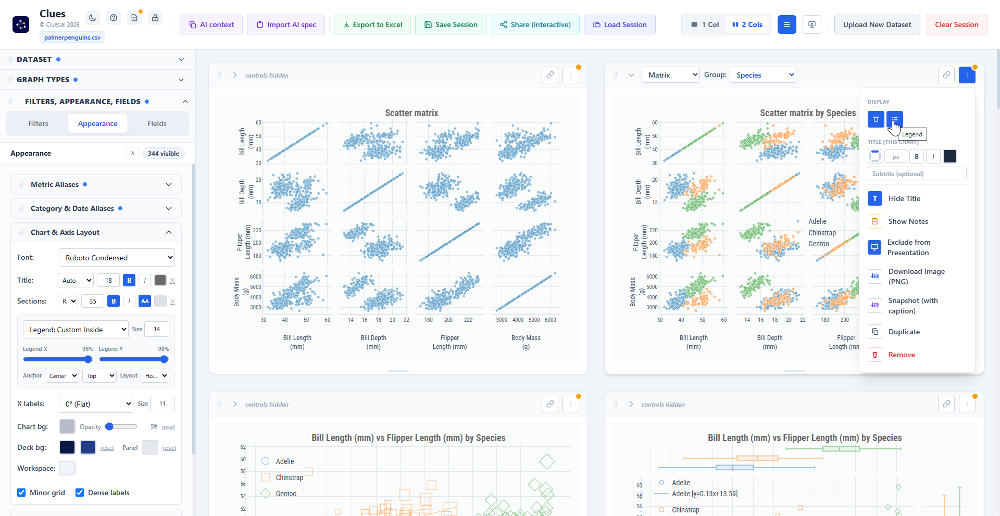
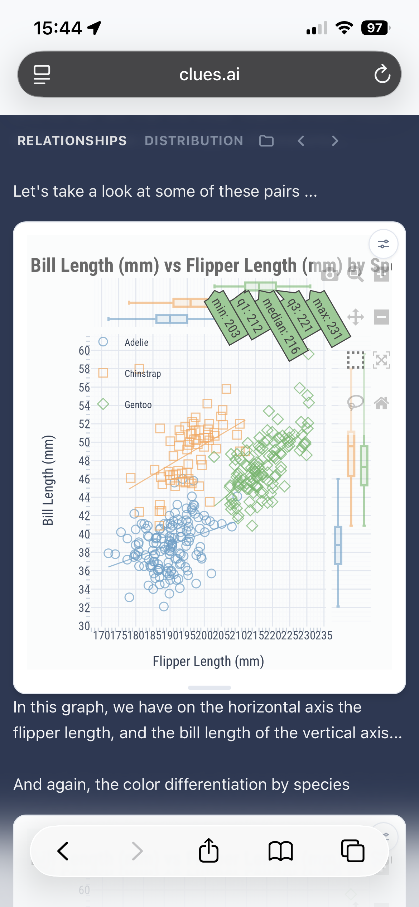

# Clues - Version Log

Short notes on what's new. The full manual is the [User Guide](USER_GUIDE.md).

## 2026-10-04

- **Gantt warning marks.** A new Gantt setting, **Warning column** (⋮ > Gantt style > Layout): every task with a value in that column gets an amber **!** just after its bar (after its label, when bars carry one); hovering the **!** shows the value. A task hidden in a folded summary task or swimlane puts its mark on the folded row, which lists the tasks inside. The bars do not change: the mark only tells. A new Gantt picks a column named Warning, Alert, Issue or Planner differs by itself; the AI context names the column (`chart_pm` `warning`). Made for project apps whose plan and task list can disagree ("Planner differs").

## 2026-10-03

- **Height free chart.** A new button in the Present bar (up-and-down arrows, shown when the deck has a Gantt; off by default, saved with the session as `presentTall`, so a deck saved with it on opens with it on): each Gantt takes the height its rows need - about 26 px a row, so fitted task names reach 14 px - even taller than the screen; the deck scrolls. Off again, the chart fits one screen as before. For plans with several projects, where one screen squeezes the names too small to read.
- **Gantt arrows reach folded rows.** A link whose task sits under a folded summary task or in a folded swimlane is now drawn to the row that hides it (the folded summary, or the lane header), at the task's own dates, as Planner draws it; before, it disappeared. A link inside one fold is not drawn; several links between the same two rows are drawn once, from the predecessor that ends last. The count of conflicting links now covers every link, folded or not.
- **Copy prompt on AI responses that came with a deck.** A deck's site may send back the full prompt its AI got (`{reply, prompt}` when Clues asks with `withPrompt`, or `aiOnOpenPrompt` next to a kept `aiOnOpen` reply); the entry in **Dataset > AI responses** keeps it, and **Copy prompt** puts it on the clipboard - to see exactly what the AI was told.
- **AI context: a presentation note keeps its look.** `chart_preso_note` now says plainly that an omitted attribute keeps that note's current value: to change only the words, pass `ref` and `text`.
- **A deck can ask for its AI reply as it opens.** A deck opened from a link may carry `aiOnOpenRequest` (an address on the deck's own site and an instruction). Clues then does what a user does with Copy AI context, without the copying: it builds its full AI context exactly as Copy AI context does by default (styling mode - every styling operation, slide comments included - all charts, data samples), sends it with the instruction to that address, and applies the answer like a pasted reply - validated, listed in **Dataset > AI responses**, undoable. A notice counts the wait. Only the site the deck came from is asked; any other address is refused and nothing is sent. `aiOnOpen` also takes the reply text as an assistant wrote it. The smoke test opens a deck that asks.
- **A deck can carry an AI reply to apply when it opens.** A `.clue` with an `aiOnOpen` field (an AI reply in the usual spec format) has it applied through the normal **AI import** as the deck opens - validated, applied, and listed in **Dataset > AI responses** with its undo - quietly, without the import dialog. A project app uses it to send its AI narrative (presentation notes, notes in charts, subtitles written from its latest data) with each deck, so the narrative can be seen and undone in Clues. Saving never writes the field back: it applies once per open. The smoke test opens such a deck.

## 2026-10-02

- **Gantt summary tasks, as in Planner and MS Project.** Pick the column that names each task's summary (parent) task - by task name or ID - under **⋮ > Gantt style > Summary tasks > Summary task column** (an auto-built Gantt picks a column called *Summary task* or *Parent* by itself). Each summary row then follows with its own tasks, gets a **bold** label and a thin **bracket bar** with end caps spanning its tasks (its own dates count only when none of its tasks is dated), and stays out of the status colors and the critical-path outline. **Click a summary bar to fold** its tasks away (the label turns from ▾ to ▸; links to the hidden tasks go with them) and click again to show them; folds are saved with the chart, so a deck can open folded. **Summary bar color** sits in the same section (default: the text color). Swimlanes are off while a summary column is set.
- **Security fix: rich text from a deck is always cleaned.** Presentation notes, the title slide and chart titles are now cleaned where they are shown, not only when edited, and the cleaner reads them in an inert document (before, markup such as an image with an error handler could already run while being cleaned). A .clue file is data from anywhere - with deck links (`#open=`), a crafted link could otherwise have run script on clues.ai. The smoke test opens such a hostile deck and fails if anything in it runs.
- **Gantt names: colored and fitted.** Once you set a **Swimlane bar color** or **Summary bar color**, the lane and summary names on the axis take the same color as their brackets (task names keep the axis color). New **⋮ > Gantt style > Layout > Fit task names to the rows (6-14 px)**: the names on the axis are sized to the row height after every draw, resize or fold - small for a crowded plan, back up to 14 px when projects are folded. The AI sets it as `fit_labels`.
- **Gantt task borders.** **⋮ > Gantt style > Bars > Border thickness** and **Border color** outline every task bar and milestone (the color defaults to the bar's own group color); the AI sets them as `border_width` / `border_color`. Outlines - the borders and the critical-path outline - now sit on top of the progress shading, which used to cover part of them.
- **"Pulling data from your feed..."** While a deck link (`#open=`) is being fetched, the start box says so and names the address it pulls from, instead of inviting a file drop; if the link fails, the usual box comes back with the reason.
- **Fold from the names too, with a pointing hand.** A swimlane or summary task now folds (and unfolds) by a click on its name on the axis as well as on its bracket bar, and the cursor turns into a pointing hand over both - the crosshair stays on everything else.
- **Swimlane bar color.** Swimlane brackets (for example one per project) can take a color of their own, apart from the summary tasks inside them: **⋮ > Gantt style > Layout > Swimlane bar color** (until set, lanes use the Summary bar color). The AI sets it as `lane_color`.
- **Gantt arrows drawn like Planner's.** Dependency arrows have rounded elbows, and when a task starts the moment its predecessor ends (or before), the arrow loops out to the right and comes back into the task from the left instead of running unseen along the bar edges. Arrowheads always point into the task; conflicting links stay dashed red, critical ones keep the critical-path color.
- **A lighter page for deck links: `https://clues.ai/live.html`.** The same app without the built-in Penguins showcase - about 0.42 MB to download instead of 0.9 MB - for decks opened from a link (`live.html#open=<address of a .clue>`). Opened without a link it lands on the start screen; your own session is restored as on the main page. `deploy-public.mjs` writes it on every deploy, and the smoke test checks it (no showcase, deck link presenting).
- **Swimlanes and summary tasks together; lanes fold.** **Swimlanes by** (for example Project) and the **Summary task column** now work together: each lane holds its own summary tree. Lane headers get the same bracket bar as summary tasks, and a **click on a lane folds the whole lane** to that one bar - with several projects, fold them all for a portfolio view and open one to see its tasks. Folding only hides rows; choosing which projects to show stays in the Filters. **Folded swimlanes** (Gantt style > Layout) counts the folded lanes and has **Unfold all**; the AI reads and sets them as `folded_lanes`. An auto-built Gantt on a table with several projects (a column called *Project*) starts with one lane per project.
- **The AI knows the summary settings.** The AI context explains them, and the chart_pm op reads and sets all three: `summary` (the column), `summary_color`, and `folded` (the summary task names whose tasks are hidden, e.g. `"folded": ["Question 2"]`; `[]` shows all). A chart's line in the context shows its summary column, bar color and folded summaries by name. The menu's **Folded summary tasks** row counts the folds and has **Unfold all**.

## 2026-10-01

- **Open a deck from a link.** `https://clues.ai/#open=<address of a .clue>` (or `?open=`) fetches the deck and opens it exactly like a dropped `.clue` - password prompt, drift check, and the saved Present mode - so a team can put "open the status deck" behind one click, with no file to download or pass around. If the deck has a connected data source, it checks it right away, so the charts show the source's latest data. The session you had is kept one step back: the "Deck opened" message offers **Back to my session**. Only https addresses are accepted (plus localhost for development); the site holding the deck must allow clues.ai to read it, and a refused or unreachable link says so and brings your session back. Use the `#open=` form when the address carries an access key: browsers never send the part after `#` to clues.ai. A phone-sized screen plays the linked deck as a presentation, like the welcome screen's Open button.
- **Smoke test** covers the link: the sample deck opened from `#open=` must present with data, and an address Clues does not accept must open nothing and say so.

## 2026-09-30

- **Project-management charts.** Four new types plus burnup/burndown, all native Plotly (no new dependency), each with AI encodings in the chart registry:
  - **Gantt (Over Time)** - tasks as bars from start to end (or a number of days), zero-length tasks as milestone diamonds, color by status/phase/owner, optional progress shading, a dashed Today line, start-date or data order. **As of** turns a history table (one row per task per snapshot) into the plan as of its latest snapshot. Suggested automatically on the Overview when the data looks like a plan. The Over Time tab now opens for a date plus a category, since plans often carry no numbers.
  - **Radar / spider web (Comparisons)** - one shape per group across 3+ measures picked with a compact **Spokes** checklist; mean or median; spokes in different units are rescaled 0-100% of their range and the chart says so (Auto / 0-100% / Raw values).
  - **Pareto (Comparisons)** - categories sorted high to low by row count or a measure's sum, cumulative % on a right axis, dashed 80% guide; the tail past 20 folds into "Other".
  - **Risk matrix (Comparisons)** - likelihood x impact with a count per cell and green/amber/red diagonal zones; levels order themselves (numbers, and common rating words); optional risk names in the hover.
  - **Burnup / burndown (time series "Values" menu)** - sum or count per date, running total with a dashed scope line (undated rows count toward scope), or remaining; optional **Finish by** date for an ideal line.
- **Gantt dependencies and critical path.** A **Depends on** column (predecessor names, or row IDs; MS Project codes like `5FS+2d` read as finish-to-start) draws arrows from each predecessor's end to its successor's start and outlines the critical path in red - the tasks with no slack, computed on the plan's own dates with a backward pass from the finish (nothing is rescheduled). Hover shows each task's slack; a successor that starts before its predecessor ends is a dashed red arrow with negative slack; the caption counts unmatched names and names any dependency loop. Toolbar toggles hide the arrows or the critical path.
- **Cumulative flow (Over Time).** Items (or a measure's sum) per status per snapshot date, stacked finished-at-the-bottom to backlog-on-top, from a history table with one row per item per snapshot. Suggested on the Overview when the data looks like one.
- **Burndown from snapshots.** "Sum per date" now takes a **Finish by** date too (ideal line from the first value to zero), and every per-date mode starts its axis at zero.
- **BI-style tuning for the project charts.** A new **Gantt style / Radar style / Burnup / burndown style** section in each chart's ⋮ menu: critical-path color and thickness, arrow color/thickness/arrowhead, bar height and bar labels, milestone shape/size/color, finished-part color, row shading, and a date line at today, the As-of date, or a chosen status date (color, style, thickness); radar spider-web grid (now the default), manual scale and rings, fill opacity, line thickness, markers, value labels, and a target ring; burn line shape, end label, and scope/ideal line styles. One table (`PM_STYLE_PARAMS`) drives the controls and a new AI styling op, `chart_pm`, validated knob by knob.
- **Gantt swimlanes, time axis, weekends, baseline.** Group rows by a column with lane headers and summary bars; days/weeks/week-number/month/quarter axes; weekend shading; baseline bars from planned start/end columns (auto-picked by name) with the finish variance in the hover.
- **Projected finish** on burnup/burndown: a toolbar toggle drawing a dashed straight line at the last N periods' pace to the scope or zero, captioned with the landing date and its distance from Finish by.
- **Annotate Chart** on the Gantt, the cumulative flow, and the Pareto.
- **Samples.** `project-plan-sample.csv` gained a Depends on column (and dates that give it a clean critical path plus one deliberate conflict); new `project-history-sample.csv` is the same project as nine weekly snapshots, with scope added mid-project. The plan sample also carries Baseline start/end columns (the slipped tasks' original dates).

## 2026-07-24

- **PowerPoint export: the deck background moved to the slide master.** Each slide used to paint its own background - and a gradient deck was silently flattened to its average color. The background now lives once on the slide master (solid colors as a native fill, gradients rendered to a background image honoring the deck angle), so editing the exported .pptx means changing ONE master in PowerPoint's View -> Slide Master, and gradients finally survive the trip.
- **Open-ended shades.** `chart_shade` accepts just one bound: only `to: 15` shades everything below 15, only `from: 250` everything above - the band runs to the edge of the axis and the label anchors at the finite edge. AIs kept writing this natural form ("Lightweight Class <2500 lbs") and getting rejected; now it means what it says. The AI context also states explicitly that annotation text sizes are per op (notes default 12px, shade/marker labels 10px - a house style must pass "size" on each).
- **Inside legends are draggable.** A legend placed "inside" the chart (by you or your AI) can now be grabbed and moved; the first drag converts it to a custom position that saves with the session. Dragging was previously reserved for legends already set to "custom" - and a guard silently discarded drags on anything else.
- **No dataset, no side panel.** Before any data is loaded the left panel had nothing to offer ("Upload data to see settings") - it now stays out of the way entirely and appears once a dataset or session is open. The **Dataset description** and **audit trail** header buttons disable too - nothing to describe or sign yet. The upload zone and the header's Load button already cover every way in.
- **"Appearance" is now "Style".** The middle sidebar tab reads **Filters | Style | Fields** - shorter, and everything in it is styling anyway (themes, series styling, backgrounds, layout). Every pointer in the guide and tooltips follows; saved sessions are untouched (the internal key never changed).
- **One Aliases section.** "Metric Aliases" and "Category & Date Aliases" merged into a single **Aliases** collapsible in Appearance - every column in one list (dates tagged), one Reset for all. The split was plumbing, not something worth two panels.
- **One continuous scroll through all your charts.** Browsing a chart family with the side panel open, an extra wheel push past the bottom of the page turns to the next family - and past the top, to the previous one. The push must be deliberate (a real nudge at the boundary, with a beat of lockout after each turn), so normal scrolling never switches tabs by accident.
- **The source-file pill moved home.** The dataset's file name now sits in the sidebar's Dataset group header, next to its chevron, instead of under the wordmark - one less line in the top bar.
- **A slimmer top toolbar.** The header lost a third of its height: the wordmark is smaller, the copyright line is gone, and the buttons carry one-word captions that never wrap - AI context, AI import, Excel, Save, Share, Load, New Dataset, Clear. The tooltips still spell out exactly what each one does.
- **Sankey arrangements survive.** Drag the nodes into the layout you want - the positions now save with the chart (keyed by node name), persist through autosave, session files, and sharing, and restore exactly on reload. Nodes without a stored spot (new data values) simply flow into place. Also: parallel ribbons of the same pair now alternate shade depth and every ribbon carries a hairline seam, so per-row splits are visible at rest, not only under the mouse.
- **Sankey, the SankeyMATIC cut.** Three refinements to the edge-list flow diagram: node captions now put the amount on its **own line under the name** (the income-statement look); **duplicate source->target rows stay separate parallel ribbons** instead of being summed - hand-authored splits (which slice of Net Sales becomes Cost vs Gross Margin) keep their meaning (very large link files still aggregate for speed); and hovering a band no longer **doubles the amounts** - the tooltip reads bare names plus the band's own value. Nodes were already draggable; their two-line captions ride along.
- **CRITICAL: sessions with year-style date columns opened with every chart blank.** The 2026-07-25 change that turns numeric calendar values into real dates (2007 -> 2007-01-01) silently invalidated the DATE FILTERS of every session saved before it: the saved filter still listed "2007", no row matched, and every chart - the Palmer Penguins showcase included - rendered empty axes. Restoring a session now migrates its date-filter values through the same rules, so legacy sessions, portables, and the showcase all heal on open. The smoke test now also asserts that showcase charts actually carry data - counting chart frames alone is how this one slipped through.
- **Tile region maps: the blank-chart bug, actually fixed.** A tile choropleth draws nothing until its boundary file arrives from the CDN - but the chart's trace cache didn't know when it had, so the empty chart stuck for good unless some unrelated setting forced a recompute (which is why toggling "Chart toolbars" seemed to cure it). The boundary load now invalidates the cache: the map appears on its own the moment the boundaries land, in every view, toolbars or not - and the replay starts right up.
- **Tile-map replay: no more dead white maps.** On Streets/Light/Dark basemaps, a replay step fired while mapbox-gl was still loading its style crashed inside Plotly (an async error no guard could catch) and could blank the map for good - with real network latency this hit most presentation opens, and only a resize (e.g. expanding the chart controls) revived it. Replay steps now wait for the map style to be ready, at boot and after any rebuild. The on-map play chip also got smaller and quieter.
- **Race bars: newcomers get their bar.** The bars panel's category axis froze on the opening cast, so a series entering mid-race (data starting at a later date) landed outside the axis and stayed invisible until a manual autoscale. The panel is now sized for the full cast from frame one - series without data yet wait at the bottom of the axis with no bar, and rise into rank the moment their first value arrives.
- **Maps: play and pause ON the map.** The replay's only play button lived in the toolbar - hidden exactly when presenting, so a deck saved paused could never start. A small ▶/⏸ chip now sits at the map's bottom-left corner beside the scrubber, in every view: start, pause, and scrub a replay without any toolbar. The state still saves with the session.
- **One Play/Pause button on the bar race - and Pause means stop.** The separate Play and pause buttons confused: now a single button toggles (it flips between "Play" and "Pause"), and pausing **empties the queue** - the interrupted run doesn't count as a playthrough and any pending repeat is cancelled, so the race never resumes on its own. Grabbing the timeline does the same. Play after a pause resumes from that spot with a fresh repeat count; Play at the end rewinds and starts over.
- **Every racing bar gets its name.** With many series Plotly silently dropped every other bar label - an unlabeled bar says nothing. The bars panel now labels every bar, shrinking the font to fit the chart's height (floor 7px).
- **Maps: replay saved ON now starts by itself in Present.** A session saved with the replay running (say, infinite loops) could open into Present with a still map: the replay engine checked for the plot before Plotly had finished building it and gave up for good. It now waits for the plot and then starts - fresh loads, Present slides building as they scroll into view, all covered.
- **Race caption dodge, the OWID way.** The first cut of caption de-collision spread labels across the whole axis (guessing at the chart's height), sometimes parking the leader off-plot. Now: captions stay exactly at their value unless they truly collide; a colliding group spreads only as far as needed, centered on its own values and clamped inside the plot; each displaced caption gets a thin **leader line** back to its line end - the device Our World in Data uses; and when the captions physically cannot fit the chart's real height, the font auto-shrinks (floor 8px) before any overlap is allowed. Also fixed: replaying the race (Plays x2+) now properly rewinds the trails - the restart and the play no longer race each other.
- **Bar race gets the map replay's controls.** The race toolbar now carries **Plays** (x1 / x2 / x3 / x5 / infinity - Plotly plays frames once, so the card restarts the run itself), a **0.5x** speed below Slow, and a **spacer** between the trail and the bars panel (a % of the width, empty = 8) for decks where the trail's name captions were crashing into the bar labels.
- **Race captions: sized, wrapped, and de-collided.** Two new boxes set the line-end captions' **size** (px) and an optional **wrap width** (characters), so long names stack onto short lines instead of running into the bars. Captions that would overlap - lines ending at nearly the same value - are now **spread apart vertically** and kept inside the plot, no longer printing on top of each other.
- **Race numbers follow the field's format.** The values at the end of the bars, and the ones in the trail captions, honor the **Decimals / thousands / prefix / suffix** set in the Fields tab (they were hardcoded to 4 significant decimals), and the timeline's step readout follows the date field's **display format** ("1952", not "1952-01-01") - the same rule the map replay ticker uses.
- **Long axis labels stop being sliced off.** Category names on a horizontal bar chart ("Central and South America (IEA)") were cut at the figure's left edge, and no axis control could rescue them - the fixed margin, not the axis position, was the cage. Every axis now grows its margin to fit its tick labels; nothing that already fit moves.
- **Bar legends read the category names.** Switching the legend on for a plain bar chart used to produce a single entry labelled "trace 0" - Plotly's name for an unnamed trace. Each bar is now its own named series, so the legend lists the actual categories in their colors and each entry hides or shows its bar. (Value-scaled fills and single-series charts name the entry after the measure instead.)
- **Map replay ticker follows the contrast rules.** The big caption showing the current replay value used to default to near-white - invisible on the plain white Outline basemap. It now defaults to the same contrast ink as everything else (dark text on light basemaps and canvases, light on dark tiles or a dark deck), and the toolbar color chip shows the effective color; picking a color still overrides.
- **The Fields list scrolls in place.** With a wide dataset (19+ columns) the field cards ran the sidebar into a very long trek; the list now lives in its own bounded scroll region (like Series Styling), so every column is a wheel-scroll away without leaving the panel header behind.
- **Bubbles on categorical and date axes.** A scatter's X or Y can now be a category or a date field, not just a measure - sized dots per category over the years is the Our-World-in-Data natural-disasters look (Y = disaster type, X = year, size = deaths). Hover shows category values as themselves, and the numeric-only extras (trendline, marginal distributions, jitter) quietly sit out on a non-numeric axis. The AI's scatter/bubble types accept the wider axes too.
- **Bubble charts, one click away.** The chart's own type dropdown carries the identity too: a sized scatter shows as Bubble, picking Bubble adds a size field, picking Scatter clears it - no more silent revert. A Bubble entry joins the Relationships picker (a scatter preconfigured with a third measure on point size), the analyzer suggests a "Bubble view" when three or more measures exist (axes = the most correlated pair, size = the most varied remaining measure), and the AI catalog gains a bubble type (x, y, size, color) so "build a bubble chart" lands correctly. Suggested charts also stopped treating a sized scatter as a duplicate of the plain one.
- **The analyzer spots date-shaped numbers too.** A numeric column named like a year (holding 1500..2200 integers) or shaped YYYYMM / YYYYMMDD now gets its own "Treat as dates?" suggestion with a one-click Convert - on Palmer Penguins, converting year immediately surfaces a "Trend over time" suggestion, unlocking the whole Over Time family (time series, forecasts, decomposition, replays) plus date filtering. Bare years become real dates (2007 reads as 2007-01-01), and such columns no longer compete in the treat-as-categories advice - the date reading wins.
- **Waterfall charts.** A new Comparisons type - the P&L bridge: each category is a relative step (the sum of the metric; positives rise green, negatives fall red), connectors between bars, signed value labels, and an automatic Total bar you can toggle off. Steps follow the data's own order, colors and orientation sit in the toolbar, hover shows each step's change and running total, and in-chart annotations work on it. AI: the waterfall type (steps + change encodings) and chart_display wf_up_color / wf_down_color / wf_total_color / wf_total. Native Plotly - no new dependency.
- **Charts open at one-slide height in Presentation view.** A chart with no explicit height now fills the window's vertical space - each chart IS one slide from the get-go, sized to whatever screen shows the deck (the default is computed live, not stored, so a shared deck refits any monitor). Dragging a height still pins that chart to your chosen size.
- **One click turns discrete numbers into categories.** The Stat overview's "Treat discrete numbers as categories?" advice now carries a Convert button that retypes every candidate column at once - and the analyzer immediately re-runs on the new types, surfacing grouping suggestions (compare distributions/averages across groups) that were impossible while those columns were numeric. The Fields tab can still flip any column back.
- **Series start at 15% transparency.** New sessions default every series to 85% opacity instead of 70% - crisper points and bars out of the box. Saved house styles, saved sessions, and any slot you have styled keep their own values.
- **A pencil button for presentation edit mode.** The toolbar gains an icon-only pencil just left of Present: one click hides the side panel and drops you into presentation editing (notes, images, sizes, placements) - the same switch the logo toggle performs, now discoverable; click again to return to the workspace.
- **PowerPoint charts embed as SVG.** Vector charts land on the slides as real SVG (with an automatic PNG fallback for old Office clients) - in PowerPoint, right-click a chart and Convert to Shape to edit every line, label, and point natively. WebGL charts (3D, scatter matrix, tile maps) cannot vectorize and stay high-resolution PNG.
- **The title slide exports true to the deck too.** Slide 1 of the PowerPoint and PDF exports now replays the rendered title slide - the heading, the date, the rich description text (as an editable text box in PowerPoint), and the slide image, each at its measured position and proportional size, including dragged layouts. The centered synthetic page remains only when the description slide is off. A font-scale slip in the measured note text (33% oversized in PowerPoint) is fixed in the same pass.
- **Slide exports now REPLAY the rendered deck.** Instead of re-deriving the layout from settings, the PowerPoint and PDF exports measure each slide as it renders on screen - the plot, the presentation note, and the deck image land on the page at the exact positions and sizes they occupy in the deck, including dragged free notes, gutter images, and 12-column grids. Note text scales to keep its on-screen proportion. (The settings-based layout remains as a fallback for unmounted charts.)
- **Exports save where you point them again.** The folder picker demands a live click, but slide composition takes long enough to lose it - the console showed SecurityError and a silent fallback. The destination is now acquired the moment you click the export, and the file is written there when the bytes are ready.
- **Slide exports honor the deck image geometry.** The PowerPoint and PDF exports were sizing every chart-side image at a fixed width and ignoring free placement; they now carry the authored width (band px or %), the side placements at their edges, and free-placed images at their own x/y - overlaid without shrinking the chart, and measured against the real presentation band.
- **The 3D-trajectory suggestion stops firing on category-like numbers.** "Change smoothly from row to row" used to trigger on small repeating integers (1, 4, 4 ... 1, 5, 4) whose sorted order merely looked monotonic. A path coordinate now needs many distinct values, few flat repeats, and a much higher smoothness bar - real x/y/z data (mesh files, tracks) still suggests, grouping codes never do.
- **The PDF export is now composed, not printed.** The Export menu's PDF is built page by page like the PowerPoint export - one landscape page per slide (chart + note + image + deck background), a contents page with clickable internal links, charts embedded as fast-writing JPEGs - and saves directly with no print dialog. Browser printing shears slides inside flex/grid layouts on some decks; composing sidesteps the print engine entirely. Ctrl+P remains for whoever wants the browser's version.
- **Export to PowerPoint.** The Present bar's new Export menu saves real 16:9 .pptx slides: title slide, CLICKABLE contents slide, a divider per section, then one slide per chart - the chart as a high-resolution image, the presentation note as an EDITABLE text box (bold, italics, colors, bullets, sizes carried over), the deck image embedded, and the deck background as the slide background. Faceted charts tile their panels. Built fully in the browser (pptxgenjs, pinned, loaded on first use).
- **PDF pages no longer shear slides.** Chromium cannot page-break inside flex or grid containers - the chart list is laid out as plain blocks while printing, so every page now holds exactly one whole slide (the 8-slide showcase prints 13 pages: title, contents, dividers, slides - was 28 broken fragments).
- **Print the whole presentation to PDF, one slide per page.** A print button in the Present bar (beside the arrows) prints the deck the way it presents: each slide - the chart WITH its presentation note and deck image - gets its own page, a clickable CONTENTS page opens the document (the links survive in the saved PDF), the deck background prints, and WebGL charts (3D, scatter matrix, tile maps) are snapshotted first so they never print blank. Page orientation is measured from the slides (landscape for the usual wide deck, portrait for tall ones) - in the dialog just choose Save as PDF and turn Background graphics ON.
- **Titles drag like annotations.** Grab a chart title and move it anywhere - a plain click still edits the text, the Chart options position picker returns it to a preset, and the Title section there holds the font size. Dragged positions save with the session.
- **Subtitles stop overlapping the plot.** A subtitle renders below the title's anchor line, so top-anchored titles now shift up by the subtitle's height and bottom ones down - the second line lands outside the plot, not on it.
- **Sunburst and treemap titles default to the bottom.** Their shapes fill the top edge; the title now starts out of their way (the position picker still puts it anywhere).
- **Shade and marker labels get a font size.** Same as notes: set it by clicking the label on the chart (the popover gains a Size box), or in the Annotate panel rows; default stays 10px. The AI drives it too - chart_shade and chart_marker gain "size" (6..48), and Capture-current-look round-trips it.

## 2026-07-23

- **The AI contact sheet is readable again.** Tiles now render at double the layout size into the same cell, so axis labels, legends, and annotations come out at the proportions the chart really has on screen instead of masking half the tile - scatter matrices stop scrambling their labels, and the ref captions keep their own size. Better pictures in, better restyles out.
- **Your AI now knows what surface it styles for.** The copied context reports the canvas state - app theme, deck harmony on/off, deck page background (or gradient), chart background, workspace background - with an explicit rule: pick ink, title, legend, and gridline colors AGAINST that surface (light ink and faint grids on dark decks - never solid white), and leave transparent charts to the automatic contrast unless asked. No more light-surface guesses producing invisible captions on a dark deck.
- **Chart notes edit like Excel comments.** Click a note right on the chart and a small popover opens at the cursor: text, font size, box WIDTH (set one and the text wraps to fit - the note becomes a real comment box), color, arrow, delete. The same size/width controls join the Annotate panel, and the AI's chart_note gains "width". Notes and their arrows also follow the deck's auto-contrast ink now, so they stay visible on dark or transparent presentation backgrounds - and the note pill flips light/dark to contrast with the text color.
- **The AI restyle brief teaches the annotation layer.** The deep-makeover context now walks through all three in-chart annotation tools (shades for eras and target bands, marker lines for thresholds and events, notes as wrapping callout boxes with size/width/arrow/offsets) and when to use each - so a Gem holding your house style produces decks where each chart answers "so what?" in-frame.
- **Series styling reaches the scatter matrix.** Matrix points now use the same hollow-marker system as the scatter - the ring is the series color at its transparency, Thick sets the ring width, Fill tints the interior - so the per-series knobs and the new all-series row act on it like on any scatter.
- **Style every series in one move.** Series Styling & Aliases gains an "All series at once" row: transparency, fill, thickness, point size, shape, and line style applied to EVERY series of the color-by field in a single edit - no more nudging ten sensitive sliders one by one. Individual series stay tweakable afterward, and an Undo link restores the styling exactly as it was before the first all-series change.
- **The whole side panel scrolls as one.** The sidebar groups (Dataset, Graph Types, Filters/Appearance/Fields) now live on a single scroll surface - expand a group and scroll it to the top of the screen; nothing is trapped below the fold anymore.
- **Contact sheets are named after the dataset.** The AI contact-sheet PNG saves as clues-tiled-charts-<dataset>.png instead of one fixed name, so sheets from different sessions never overwrite each other.
- **Zero lines melt into the canvas grid.** Axes whose range crosses zero drew their zero line in the full-strength theme color, glaring through dark or transparent canvases as an extra "frontier" line the grid patch never touched (Time Postprandial and ratio panels on the diabetes matrix). Zero lines now follow the same faint color as the canvas gridlines, on 2D axes and 3D scenes alike.
- **Click any annotation to edit or delete it.** Shade and marker labels join notes: click one on the chart and a popover offers the label text, its color, and delete - no more digging through the Annotate panel to remove an AI-placed band or threshold line.
- **Annotation colors obey the contrast rules everywhere.** An explicit note, shade-label, or marker-label color that has almost no contrast against the chart's actual opaque background (dark AI-picked text on a dark canvas, white leftovers on white) now falls back to the readable ink - same guard as chart titles; readable color choices pass through untouched.
- **The scatter matrix stops mixing two ink colors.** Canvas ink and grid patches covered only the first four axes of a chart; a matrix with five or more measures showed half its captions in the deck ink and half in theme slate, with full-strength gridlines glaring on dark canvases. Every axis is patched now - verified uniform across all panels.
- **Smarter scatter-matrix picks, and Dim selects to edit them.** The suggested matrix now scans up to 20 numeric columns (was 12 - late columns like waist/hip never even competed), excludes id-like columns (named like an id, or unique running integers), and when two columns nearly duplicate each other (r² ≥ 0.9) only the better-connected one takes a slot. The chart's note explains every choice: what was folded and why, which id columns were skipped, and which relations are so tight (r² ≥ 0.6, like waist ↔ hip) that they are likely definitional rather than findings - on the note, never cluttering the chart. And the matrix, correlation heatmap, and parallel coordinates gain **Dim selects** in the toolbar: pick exactly which measures the grid shows, set a slot to none to drop one.
- **Titles survive the switch back to opaque backgrounds.** Captions and gridlines already re-adapt when a chart leaves the transparent deck for its normal whitish background - but an explicit title color chosen for the dark deck (a near-white, say) stayed and vanished on white. A contrast guard now steps in exactly there: when the explicit title color has almost no contrast against the chart's actual opaque background, the title falls back to the theme ink; any readable color choice (a brand purple, a muted slate) is left untouched.
- **Note pills contrast for real now.** The background pill behind an in-chart note was meant to flip dark under light text - a color-parsing slip made it always light, so on a dark deck the auto-contrast (whitish) note text sat on a bright pill, unreadable. Fixed: light text gets the dark translucent pill, dark text the light one, on any deck background. The same slip made 100% stacked bars always use white segment labels (now dark on light segments) and broke the bars' one-color gradient fill (it silently produced invalid colors).
- **All / None on the suggested charts.** The Stat overview's suggestion list gains two small links (left, above the list) to check or clear every suggestion at once - pick a few instead of unticking one by one.

## 2026-07-22

- **Stacked 100% survey bars (the Pew look).** The bar Layout select gains Stacked 100%: each bar splits into the row-count SHARES of the split values - the metric is ignored, so survey data needs no value column. Integer share labels sit in the segments (auto-hidden under 3%, contrast-aware text), hover gives the exact percent and n, and the sort button then ranks bars by the share of the FIRST split value - agree-first, the survey read. Shares are computed in plain code, not by the plot library, so every number on the chart is auditable. AI: chart_bars mode percent.
- **Box and violin groups sort by median.** A toolbar button cycles high-to-low, low-to-high, and the original order - the same one-click cycle bars have. Funnels get one too: widest first (the default), the data's own stage order (for true pipeline funnels), or narrowest first.
- **The Q-Q reference line stays inside the data.** It is now clipped to the data rectangle on both axes, so a heavy tail can no longer stretch the plot range past the points themselves.
- **Density marginals talk numbers.** Hovering a marginal density curve on a scatter shows the group's median, IQR, and n - formatted with the field's saved number format.
- **Sankey flows carry their numbers and colors.** In from/to mode each node writes its total next to its name - the signed sum of what flows in (pretax income shows 10, not the 19 that adding absolute widths would claim) - with an Amounts toggle to turn it off; hovering any band or node shows the exact amount. Bands inherit the color of the node they leave, and negatives offer the three standard treatments (Negatives select): red inflows (default - keep the recorded direction at absolute width, in red; node totals keep the signed math), reversed (a negative flow into a node draws as a positive flow out of it - costs branch out of the node they drain - and node totals match the drawn widths so numbers agree with what the eye sees), or loss nodes (the reversed flow lands in its own red "(loss)" node, leaving the original node to its positive flows). And Width now defaults to your first numeric column instead of row count - a flow chart where every band is one row wide says nothing. Amounts follow the width field's saved number format from the Fields tab, and an unformatted fraction column (every link within -1..1, like a contribution share) auto-displays as percent: 0.822 reads as 82.2%. AI: sankey option amounts on | off.

## 2026-07-21

- **Sankey reads from/to edge lists.** Data shaped source,target,value - an income statement, an energy budget - used to come out disconnected: each column was its own layer, so "revenue" as a source and "revenue" as a target were two different nodes. A new mode reads each ROW as one link instead: pick From, To, and an optional Width column in the toolbar (Rows: from / to links), names shared by both columns become ONE node so chains connect, and links aggregate when the same pair repeats. Negative flows draw red at their absolute width with the true signed number in the hover. The stages mode stays for rows-through-columns data; the AI builds either shape (sankey encodings source / target / value alongside catDims).

## 2026-07-16

- **A sort button on bar charts.** One click cycles high-to-low, low-to-high, and back to the original category order - the same per-chart sort the AI already had (chart_bars sort), now one click away in the toolbar.
- **Highlight one series - the rest step back.** Chart options gains a Highlight section: pick a MAIN series and it keeps a strong color (its own, or one you choose) while every other series tones down to light shades of a second color (default gray) - the one-series-is-the-story device, e.g. isolate China while the rest of the world grays out. Works across bars, scatters, box plots, time series, and races; the chart stops following the global palette. AI: chart_display highlight / highlight_color / highlight_other.
- **Normal Q-Q plot.** A new Distributions chart type - the graphic normality check: sample quantiles against theoretical normal quantiles (closed-form, deterministic) with an R-style reference line through the quartiles, one series per group. The formula toggle (Chart options) adds the NUMBERS per group to the legend: the Q-Q correlation r and Jarque-Bera with its exact p-value - closed-form, reproducible from the data alone. AI-buildable like every type.
- **Density marginals on scatters.** The Marginals toggle gains a style choice: box plots (as before) or smoothed per-group density curves along each axis - the seaborn jointplot look. AI: chart_display marginal_style box | density | off.
- **TSV files load everywhere** - .tsv joins the pickers (drag & drop already parsed them: the CSV reader auto-detects tabs).
- **The replay caption is bare by default.** No more dark pill behind the ticker - it sits on the deck like a headline; add a pill color via chart_display replay_ticker_bg when a busy tile basemap needs it.
- **Saved date filters no longer drop the last day.** Sessions saved before the timezone fix carried date-filter bounds one day short of the true data edge - after the fix they would have silently excluded the newest day or quarter. Bounds sitting exactly one day short of the edge snap to it on load.
- **The replay ticker is styleable, and UTC-midnight timestamps count as dates.** Ticker size and text color sit in the map toolbar; background pill and corner position via the AI (chart_display replay_ticker_size / _color / _bg / _pos). And timestamps at exactly UTC midnight (2026-01-01T00:00:00Z - how sheets export calendar markers) now display as their calendar date instead of shifting a day back in US time zones; genuine timestamps are untouched.
- **Dates no longer display a day early, and the replay ticker follows your date format.** Date-only values parsed as UTC but displayed in local time - US users saw 2026-01-01 as 2025-12-31 everywhere the day string appeared (replay tickers, race captions). Fixed at the source. The replay ticker also honors the field's Fields-tab date format - a new **2026 Q2** quarter option joins the list - and is now big enough to carry the story (what year is it when Florida turns red).
- **The scrubber reaches every datapoint.** Replay frames are no longer capped at 80/140 quantile chunks: point maps step per datapoint and region maps per unique value of the order field (a month is one complete map) - the slider picks any of them exactly, and playback simply skips frames on its wall-clock schedule, so speed and device load are unchanged.
- **Replay scrubber and an extra-slow speed.** Both map replays can overlay a slider at the bottom of the map - drag to any point of the animation, playing or not (dragging pauses the loop) - and the speed picker gains 0.5x (~80s per loop) for long time series. AI: chart_display replay_slider, replay_speed vslow.
- **Region maps: latest-value replay frames and a pinnable color scale.** Replay frames can now show the LATEST value per region instead of the running average - each frame is that period's map, made for time series like monthly rates. And the color scale takes manual min/max (values beyond saturate - fixed bounds keep every frame comparable and make anomalies read as anomalies) plus an optional midpoint for diverging palettes. AI: chart_display replay_agg; chart_colorscale min/max/mid.
- **Map replays no longer freeze slow devices.** The frame loop is now self-pacing on the wall clock: a device that cannot render every step SKIPS frames instead of queueing them (one loop takes the same time everywhere), each frame is a single Plotly pass instead of two, the next frame is scheduled only after the previous one finished (guaranteed idle time - taps and toggles always get through), and phone-sized screens get a gentler frame budget.
- **The region-map ticker names the region.** When a replay step reveals exactly one row (metric-ordered replays reveal one region at a time), the ticker reads REGION - value; chunked steps keep the value alone.
- **Region maps replay too, and replays loop a set number of times.** Choropleths gain the same replay: regions recolor step by step with the cumulative per-region average (color scale pinned so the bar never rescales mid-loop) - order by a date, or by the metric itself to light regions up lowest-to-highest. Both map replays now run a chosen number of loops (x1/x2 default/x3/x5/infinite) and then rest at the full picture. AI: chart_display replay_loops.
- **Map replay: watch the dots arrive.** Point maps gain a replay control: pick a field (usually the date) and the dots appear one by one in that order, ACCUMULATING into the full picture with a ticker showing the current value, looping until paused. Speed choices, per-chart, saved with the session - a shared deck can open animating. AI: chart_display replay_field / replay / replay_speed.
- **No more title/note riding over the plot on phones.** The compact height clamp squeezed presenting cards around their already-scaled plots, pushing the title row and caption note into the chart. On stage, cards now wrap their content (the deck scaling already fits plots to the screen); the clamp still protects the non-presenting compact view.
- **Landscape phones get a real deck.** Compact screens already flattened notes below their charts, but width caps and left offsets still applied - a landscape phone showed a squeezed chart beside dead space, under an oversized touch modebar. Cards now fill the row on compact screens and the modebar stays out of the way on stage.
- **Showcase: the 3D scatter sits out of the presentation.** WebGL scenes can freeze rendering on phones; the chart stays in the workspace (Esc) and can be re-included from its chart menu.
- **Looks now really apply.** A preset Look used to change only the default palette, which explicit per-category colors always beat - in any styled session the Apply button looked dead. Applying a Look now clears the per-category color overrides first (new theme_repaint op, also available to your AI), so the palette visibly repaints; symbols, opacities, and unlinked charts keep their styling, and the whole thing undoes in Dataset -> AI responses.
- **AI specs may say "750px".** A px suffix on any numeric op parameter is now normalized away before validation - the most common AI formatting habit no longer costs a rejection round trip.
- **Notes are read-only on stage.** In Present mode presentation notes show no toolbar and take no keystrokes until you double-click one to edit; clicking away re-locks it. Entering Present always starts locked. (The title slide is unchanged.)
- **Opening a deck on another monitor migrates it instead of breaking it.** The authoring view used to re-stamp the design screen without converting the stored pixel layout - after which Present stopped scaling and big-monitor decks clipped on smaller screens (and the corruption saved back). Now the whole composition rescales to the new screen at that moment: what you see is what you keep, on any monitor.
- **Decks fit sideways on smaller monitors.** Sessions saved with a design height but no design width (before the horizontal-scaling build - the embedded showcase included) never scaled horizontally, so pixel-placed charts, notes, and images clipped on narrower screens. The missing width is now inferred from the composition itself (its rightmost pixel edge, with an aspect floor) at load and stamped at save - verified zero overflow at 1366x768, 1440x900, and 1920x1080.
- **Hiding the panel always opens the deck.** Presentation view now engages whenever the left panel is hidden on a chart tab - even with a 2-column workspace. The deck itself lays out 1-column as always, and bringing the panel back returns your workspace grid exactly as you organized it.
- **Your deck, from the first click.** Fresh sessions now open with the house presentation look: the blue gradient page (#081a44 to #203f88), Roboto Condensed section headings, and every newly added or suggested chart right-placed (about 49% wide at 43% from the left) with its presentation note preset to Roboto 24 white. All of it stays editable in Appearance and per chart - these are just the starting values. Existing sessions keep their saved look.
- **chart_duplicate op.** Your AI can now clone a chart: an independent copy - fields, styling, canvas, geometry, note - lands right after the original, optionally retitled.
- **Visible slide arrows.** The Present bar chart stepper uses filled triangles in a stronger tone instead of the faint chevrons.
- **New notes default to the left again** (top-default reverted by request).
- **A deleted-then-reshown note shows its placeholder.** Deleting all text in a note left invisible HTML residue behind; an emptied note now stores as truly empty, so Show Presentation Note always brings up a visible type-here box.
- **The empty-note placeholder is centered** so a fresh note is obvious at a glance. (Notes render in Presentation view only, at their chosen position - the workspace stays chart-only.)
- **New presentation notes appear above the chart.** A freshly shown, empty presentation note now defaults to the top position so it cannot hide off the left edge; existing notes keep their saved positions. The show/hide item is offered in every view except Present mode, where it has no effect (a note with content always shows on stage); in the workspace the note itself appears once you switch to Presentation view.
- **clues.ai now opens straight into the showcase presentation.** The embedded session autoloads at boot (returning visitors resume their own autosaved work; Clear Session still offers the empty start screen). On phone-sized screens whatever restores is forced into Present mode - the deck plays full-screen instead of the small-screen gate, and the presentation bar folder button still opens any other .clue. Lean app exports stay plain: no embed, no autoload.
- **White-ink charts no longer get blazing gridlines.** When a chart has an ink color (its own chart_canvas ink or the deck melt) but no explicit grid setting, the gridlines now default to that ink at deck softness instead of inheriting the ink at full strength.
- **No more workspace flash when a shared file opens presenting.** Portable HTML files (and autosave restores) now restore the session before the first paint, so the first visible frame is the presentation - previously the empty workspace shell flashed for a fraction of a second.
- **Analysis tables start collapsed on stage.** In Present mode the tables toggle now shows collapsed header bars; expand the one you want in place. Expansion is remembered per family while presenting and resets to collapsed at the start of every show. The workspace checkbox and its open/closed state are unaffected.
- **Remove unused images in one click.** Appearance -> Images (deck assets) now shows a Remove N unused button whenever the library holds images no chart or title slide points at - the usual leftovers after re-adding images under new filenames.
- **Optimized images stay optimized.** Importing an already-small webp/png/jpeg (within the 1280px cap) used to re-encode it through a canvas and often make it BIGGER; the original bytes are now kept whenever they are smaller. Reminder: re-adding an image replaces the old one only when the FILENAME matches exactly, extension included - a penguin.png next to a new penguin.webp are two library entries; remove the old one in Appearance → Images.
- **Keep a lean app.** A new icon button next to Load Session saves a copy of Clues with the embedded dataset stripped - megabytes lighter, just the app, and still fully able to Share (interactive). The start screen hides the embedded card when there is nothing embedded, and says **Embedded:** rather than Showcase - because a shared interactive file embeds YOUR session there, not the demo.

- **Parallel-chart text is readable on any deck.** Parallel-coordinates axis names, ticks, ranges - and the category colorbar that acts as its legend - are drawn by the trace itself, out of reach of the usual axis styling. All of it now follows the same ink chain as everything else (per-chart canvas ink, deck harmony auto-contrast, theme).
- **Sankey node labels too.** The third and last chart type with trace-drawn text joins the contrast chain preemptively.
- **Categories (parallel categories) labels read on dark decks.** Like the parallel-coordinates chart, parcats draws its dimension and category labels inside the trace - they now follow the contrast chain (per-chart canvas ink, deck harmony, theme).
- **Faceted charts read on dark decks.** A faceted chart's main title and its shared legend are drawn as page text (not by Plotly), so the transparent-deck ink never reached them - dark-on-dark, as reported. Both now follow the same contrast chain as everything else (a chart's own title color still wins).
- **Fix: the stage tables button actually toggles.** The Present-bar analysis-tables button could never win against the Appearance master checkbox (unchecked = permanently hidden), and a table collapsed in the workspace stayed invisible on stage. The two are now independent: the checkbox governs the Workspace view, the stage button alone governs Present - and turning it on opens the tables regardless of their workspace collapse state.
- **Formatting over formatted text finally wins.** Applying a font or size to a selection that already contained earlier formatting could silently lose: the old inner styling outranked the new wrapper (inline beats inherited), so the pick seemed to do nothing - the root of the long "font/size does not work" saga, and notes accumulated invisible layers with every attempt. Applying now clears the same property from everything inside the selection first, like any real editor. Verified on the exact reported note: nine legacy layers, select-all, one pick - every text piece lands on the chosen size.
- **Melt mode: the link and menu buttons are visible when idle.** Their white chips showed light ink on white; neutral buttons now go transparent with ink outlines while active states keep their colored chips.
- **The note toolbar reads like a real text editor now.** The font and size dropdowns display the format OF YOUR SELECTION (or the text at the caret) - select a Courier word and the dropdown says Courier, exactly like Word or Docs. Before, they showed the note's base setting, which read as "stuck on Auto" or "stuck on Roboto" even while selection styling was being applied correctly.
- **Present notes toggle rebuilt.** The stage notes button now shows every chart note that has content (it used to reveal only notes whose per-chart toggle was already on - typically zero, so it looked dead), and toggling notes on a single chart while presenting switches the stage master on instead of fighting it.
- **Note font/size dropdowns never go dead.** After a pick landed on the whole note, choosing the SAME value for newly selected text fired no change event - the control seemed to stop responding. Opening the dropdown now resets it to neutral, so every pick registers (chart notes and the title slide). The dropdown showing "Auto" after styling a selection is by design: it reflects the note's BASE font, which selection styling deliberately leaves alone.
- **The chart menu stays readable in melt mode.** The auto-contrast ink stopped at the ⋮ menu popover, which keeps its solid bright panel - its text keeps the panel's own colors.
- **Toolbar captions follow the deck ink in melt mode.** With charts melted into a dark deck, the chart-controls captions kept their theme color and vanished; they now take the same auto-contrast ink as the charts (dropdowns and inputs keep their own solid backgrounds and stay as they were).
- **Fix (for real this time): selection font & size in notes.** Choosing a font or size for selected note text could still restyle the whole note - the mechanism depended on catching a mouse event before the toolbar stole focus, and real click paths do not guarantee that order. Selection styling no longer depends on event timing at all: Clues continuously remembers the last text selection in each note, and the toolbar styles exactly that - verified end-to-end with real browser clicks on the showcase deck. Applies to chart notes and the title slide alike.
- **Stage toggles in the Present bar.** Four icon buttons while presenting: **analysis tables** (hidden by default on stage), **chart toolbars** (hidden by default - the deck is pure charts until you summon the controls), **working notes** (the amber chart notes, hidden by default; presentation notes always show), and **Melt** (the transparent-charts switch, mirroring Appearance). All four remember their state with the session.
- **Style-legend swatches follow the ink too.** The Style-field legend deliberately draws neutral near-black glyphs so they are not mistaken for data colors - which made them invisible on dark decks. They now use the same contrast chain as their captions.
- **Fix: Clear session clears on the first click.** The delayed autosave could fire in the instant between clearing and reloading, quietly re-saving the session it had just wiped - it took several attempts to win the race. Clearing now silences the pending save.
- **A new showcase.** The embedded Palmer Penguins demo is re-recorded: an image-rich presentation with a title slide - the Presentation door on the start screen now opens into the real thing.
- **Saved sessions always carry their design screen.** Deck scaling needs to know the screen a deck was designed on; sessions saved before the feature (including the current showcase) have no record and scale 1:1. Every save now stamps it (the authoring view already did) - so any .clue saved from today fits itself to whatever monitor presents it.

## 2026-07-15

- **The style legend stays readable on any deck.** The Style-field legend used theme ink regardless of the page behind it - unreadable on a dark presentation background. It now follows the same chain as everything else: a chart_canvas legend/ink color first, then deck harmony auto-contrast, then the theme.
- **The start screen grew up.** The showcase is a card: a title band (Showcase: Palmer Penguins) over two doors - **Workspace** (the everyday workbench) and **Presentation** (straight into the full-screen deck, the best first look). And the upload button now takes .clue files too: Upload CSV, Excel or Clue.
- **The demo opens presenting.** The start screen's showcase button is now a pair: "Load original Palmer Penguins" opens the workbench as before, and a new "▶ Open in Presentation Mode" segment loads the showcase straight into the full-screen deck - the best first look for a new visitor. (The version date is gone from the label; it lives in Help & Guide.)
- **Fix: races honor your Y range.** The race value axis (Trail: Value, the bars panel, and bars-only mode) used to override the toolbar Y from/to with its own computed extent; manual values win now, and unset ends still auto-fit across all frames.
- **Race captions can carry a companion field.** A new Caption + dropdown on race charts appends another column to every line-end caption - its latest value per series at that moment of the race. Pick the date column and each caption shows when that series was last actually observed ("#2 Euro · 1.0842 · 2026-03-04 ▲1"); pick a measure or category and its running value rides along. AI: chart_display race_caption_field.
- **Race data gaps stay gaps, and captions speak your language.** An empty cell used to count as a literal zero in races and bumps, crashing a series to the floor at missing dates - gaps now carry the last real value forward, as intended. And everywhere a race or bump names a series - the line-end captions, the bars, the hovers, the bump rails - your series ALIAS shows instead of the raw column value.
- **The race is now the trail.** Bar-race charts default to the full-width trajectory view - every line end captioned with rank AND value ("#2 France · 12.2 ▲1") - with the racing-bars panel as an opt-in **Bars** checkbox. Playback is much smoother: with bars hidden nothing re-lays-out per frame (the axes are fixed up front, the now-line is data, more frames fit), and a **Speed** control sets the whole race duration - Slow, Normal, Fast, Fastest. AI: chart_display race_bars / race_speed.
- **Slides fit any screen now.** The deck remembers the height of the screen it was designed on; Present mode scales every vertical measurement - chart heights, freely placed note and image positions, the title slide layout - by the ratio to the current screen, both ways: a deck tuned on a tall monitor shrinks to fit a shorter one, and grows into a bigger one, so the next slide no longer peeks into view (and charts that ran a tad too big pull themselves in). Widths scale the same way: percent geometry follows the band as before, and DRAGGED (pixel) widths and offsets now scale by the design-width ratio too. Adjustments made while presenting are stored back in design units, so your original layout never corrupts.
- **Melt charts into the deck - one checkbox.** Appearance gains a switch that makes every chart in Presentation view transparent with faint gridlines and text, axes, legends, and titles auto-colored to CONTRAST with your page background (gradients use the blend). No per-chart work: set your deck color, tick the box, done. Charts individually styled with chart_canvas keep their own settings; AI: layout_style deck_transparent. Facet panels (small multiples) get the same treatment - canvas, ink, and gridlines.

- **Per-chart gridline color and transparency.** chart_canvas gains grid (hex) and grid_opacity (0..1); minor gridlines follow the same hue at roughly half strength, and scatter-matrix panels (whose axes Plotly generates) are covered via template defaults - "make the gridlines pastel blue at 30%" is now a real instruction instead of something the AI improvises around. Applies to 2D axes and 3D scenes, kept separate from ink so a soft grid sits under crisp labels.
- **Styling specs cannot miss silently anymore.** An op naming a chart ref that does not exist used to be skipped without a word; now a red toast lists the unresolved refs and reminds that refs come from the chart manifest. Also: the produced_by instruction no longer contains an example model name for AIs to parrot.
- **The title slide gets the same selection-aware formatting.** Color, font, and size on the title slide description now apply to the selected text only (whole block when nothing is selected), with the same re-render-proof selection memory as chart notes.
- **Fix (final): note colors stay on the selection - the real root cause.** Clicking the color swatch blurs the note, and the note saves itself on blur - that save re-renders the text and silently destroyed the remembered selection before the picker even opened; every earlier fix was downstream of this. The selection is now also remembered as character positions, which survive any re-render: the picker rebuilds it against the fresh text and colors exactly your words. The note also no longer saves when focus merely moves to its own toolbar. Reproduced and verified against a real DOM, including selections crossing bold boundaries.
- **Fix: split box/violin plots keep their dots.** Adding a Split to a box plot silently switched the point cloud to outliers-only, so the dots seemed to vanish. Split sub-groups now follow the same Dots control and auto policy as unsplit charts (every point up to 10,000 rows).
- **Transparent charts lose the toolbar chrome too.** In transparent mode the chart-controls header bar stops painting its background so nothing white floats on your deck background.
- **Fix (round 2): note colors truly stay on the selection.** The first fix left a focus cascade (restoring the selection blurred the color picker, whose blur saved, whose save detached the selection - whole-note repaint one tick later). Selection styling no longer uses the browser focus machinery at all: the remembered selection is wrapped in a styled span directly, the picker restyles that same span on every tick, and one save happens when the picker closes. Verified against a real DOM: one span, only the selected words, survives saving.
- **Fix: note formatting respects your selection.** Coloring selected note text could suddenly repaint the whole note: the native color picker fires per hue-tick, each tick saved the note, and saving detached the remembered selection - later ticks then fell back to everything. Color now paints only while the picker is open and saves once when it closes; stale selections are detected instead of misfiring. Font and size gained selection-awareness for the first time (select text, pick a font or size - only that text changes; nothing selected changes the whole note), and font-family spans survive saving.
- **Per-chart canvas colors.** A single chart can now have its own background (including full transparency at opacity 0 - just that chart melts into the page), its own ink (axis lines, ticks, labels, captions - 3D scenes included), and its own legend text color, overriding the global Appearance settings. Built for exactly the transparent-chart-on-gradient look: make one chart transparent and hand it light ink so the text reads on your deck color. AI: the new chart_canvas op (bg / bg_opacity / ink / legend_color), disclosed in the chart manifest and round-tripped by Copy current styling.
- **Truly transparent charts.** Sliding the chart background opacity to 0 now means what it says: in Presentation view the plot AND its card stop painting entirely, so the deck page background (solid or gradient) is the chart real background. Any other opacity still blends over the card surface as before. Exports of transparent charts carry the transparency (PNGs get an alpha background).

## 2026-07-14

- **Fix: images layer properly on small screens.** Freely-placed deck images (and title-slide blocks) kept their desktop pixel positions on phones and landed on top of the charts. They now fall back into the column flow on small screens - centered, width-capped, after their chart - exactly as presentation notes always have.
- **Title slide space, menu, and glide.** Blank lines and low-dragged blocks on the title slide now genuinely make it taller - the next slide starts below your content instead of overlapping it. The Present menu gains **Description** as its first entry (shown only when the title slide is on), highlighted by the scrollspy like the families. And menu clicks + arrow steps glide with a distance-scaled easing instead of the browser default, which sprinted and stuttered over long decks.
- **Fix: the Present arrows reach the title slide.** The chart-by-chart stepper only knew chart blocks; stepping back from the first chart now lands on the title slide.
- **The title slide is fully yours.** The description on the slide is now a rich-text block with the same formatting toolbar as presentation notes (bold/italic/underline, font, size, color, alignment) - edit it right on the slide. Both the text block and the image place FREELY: drag them anywhere on the slide (text by its grip, image from anywhere) with the same blue alignment guides as everything else, and resize by edge/corner handles. Slide edits are a presentation-layer copy: the Description tab stays the plain-text source, and its ⋮ menu gains "Reset slide layout & formatting" to return to it.
- **Your presentation can open with a title slide.** The Dataset description tab gains a ⋮ menu: check "Show as the first Presentation slide" and the deck opens with the dataset name, its date, your description text, and (optionally) an image from the deck library beside it - before the first chart. Saved with the session; uncheck to remove.

## 2026-07-13

- **Save remembers your session name.** Saving a session under a chosen name now keeps that name: the next Save prefills it (instead of re-deriving the dataset filename), and the name travels inside the .clue - a reopened session still knows what it is called. Combined with the remembered save folder, repeat saves go to the same file with one confirmation.
- **Notes move as freely as images.** Every presentation note gains a drag grip (hover the note, top-left): grab it and the note converts to FREE placement - drop it anywhere on its chart row, with the same blue snap guides as charts and images, on both axes. A right-edge handle resizes it in place. The L/R/T/B buttons return it to a column; the AI can place freely too (chart_preso_note position "free" with x/y, in px or band percents).
- **Unpivot columns are editable live.** While the unpivoted view is on, the column chips stay visible - tap to add or remove measures and the view recomputes on the spot (filters carry over, each change gets a lens-journal line). Plus All/Reset links for quick selection.
- **Bars stopped being enormous.** A bar chart with only one or a few categories let each bar swallow the plot. Bars now auto-narrow as categories get fewer (one lone bar takes ~20% of the plot instead of 80%; grouped bars narrow less since they share the slot). Setting the Width % knob overrides the automatic choice, as before.
- **Unpivot - as a view, not an edit.** The Fields tab gains an Unpivot panel: pick two or more measure columns, name the pair (Series/Value by default), and flip "Use unpivoted view" - every chart now reads the long form, where the measures become a category you can group, race, facet, or filter by. The stored table is untouched: Source, the journal, signatures, and reconciliation all still describe your original wide data, and the switch is recorded in the lens journal like a filter change. Each view keeps its own charts and filters - flip back and your wide charts return exactly as you left them. The AI context discloses the active view in all three modes.
- **The most-asked styling knobs, unlocked.** Bar+line combos: the overlay line gets a color swatch in the toolbar (line, dots, and its axis text follow), plus width and dash via AI (chart_bars line_color / line_width / line_dash). Error bars: color, thickness, and cap width (chart_bars error_color / error_thickness / error_cap). Donuts: the hole is adjustable (chart_display donut_hole, 0 = full pie) and pie/donut slices can show values instead of percents (pie_text). Box and violin plots: a Dots control - Auto (every point up to 10,000 rows, then outliers), All, Outliers, or None. Everything round-trips through Copy current styling and is disclosed in the AI context.
- **Candle colors are yours.** The candlestick toolbar gains two color swatches - up (closed at or above the open) and down - defaulting to the same green/red as before. The AI can set them too: chart_display with ohlc_up_color / ohlc_down_color.
- **Big files stopped being laggy.** A 54,000-row dataset (ggplot2 diamonds) was re-processed almost every time you touched anything; now work only happens when something that actually affects a chart changes. Chart data is cached and rebuilt only on real changes (filters, edits, styling, selection); off-screen charts no longer pay rendering costs; scatters above 2,500 points draw on the graphics card instead of as 54,000 separate page elements; Smooth (LOESS) trendlines fit on a deterministic 1,500-point sample past that size and say so in their caption; box-plot dots fall back to outliers-only above 10,000 rows. And datasets too large for the browser to auto-save no longer pay for the failed attempt on every change - a notice tells you auto-recovery is off and to use Save.
- **The suggested scatter matrix now picks the RIGHT five columns.** With more than five numeric columns, the "All measures at a glance" suggestion used to take the first five in file order - which could keep weakly-related ratios and drop the interesting ones (diamonds: it kept depth and table, dropped the y/z dimensions). It now keeps the five that relate most strongly to the other numerics (highest mean |r|, from the correlation scan it already runs), shown in dataset order, and says so. A matrix added manually from the chart-type menu still shows all numeric columns.
- **Candlestick / OHLC charts.** Over Time gains the financial classic: pick Open, High, Low, and Close columns (auto-guessed from the near-universal column names) and get green-up/red-down candles - or flip a toolbar switch to classic OHLC bars. Dates with several rows aggregate honestly and deterministically: open = first, high = max, low = min, close = last; no values are invented. Works with the timeline zoom slider, log scale, and manual Y ranges, and the AI builds them too (`candlestick` with `open/high/low/close` encodings, `chart_display` → `"ohlc_style": "bars"`).
- **Images snap to the grid of everything else.** Free-dragged images get the same blue alignment guides as charts and notes: edges snap to chart cards, note columns, and other images while moving or resizing - and charts and notes snap back to images in return.
- **Deck images move freely.** Grab a placed image and drag it ANYWHERE on its chart's row - it converts to free placement wherever you drop it, with a corner handle for resizing (the left/right/top/bottom slots remain as starting points, with an edge handle for in-slot sizing). The AI can place freely too: deck_image position "free" with x/y.
- **Fix: "Image beside Chart" now appears in every chart's ⋮ menu.** A wiring slip left the new menu item on only one chart per group; all charts have it now.
- **Fix: "match" notes no longer inherit a position offset.** Copying a note's styling with `"match"` also copied the source note's band offset (often left over from a drag) - harmless while charts were centered, but once charts are pinned on a grid it parked the copied note on top of them. `match` now copies styling only (font, size, color, width, gap, position); offsets stay per-chart. Note `"left"` also accepts band percents now (`"8.3%"` = the start of column 2), matching chart geometry.

## 2026-07-12

- **Smooth trendlines (LOESS).** Scatter charts get a trend-style picker: the classic straight line with its formula, **Smooth** - a LOESS curve with a 95% ribbon that follows the data's curvature, exactly ggplot's `geom_smooth` - or **Smooth only**, hiding the points for the pure relationship view ("do heavier penguins have longer flippers?" answered in one clean curve). Per-series when grouped, deterministic, self-captioned ("LOESS, span 0.75, n=342") when the formula toggle is on. AI: `chart_display` → `"trend_style": "smooth"`.
- **Images in your deck.** Appearance gains **Images (deck assets)**: link a folder (or add files) and Clues embeds resized copies (max 1280px, ~WebP) *inside the session* - decks stay self-contained, images travel with every shared `.clue`. Descriptions come from filenames or an optional `captions.json`. Place one from any chart's ⋮ menu → **Image beside Chart** (left/right/above/below, width in px or band-percent, shown in Presentation view like notes), and a running size meter warns before the session gets heavy. The AI sees the library in its context (names + descriptions) and places images itself with the new `deck_image` op - "put the team logo right of the KPI chart" now just works. Images *inside* charts (pinned at data coordinates) are the next phase.
- **Deck layouts in percentages.** Chart widths and positions (`chart_box`) and presentation-note widths now accept percents of the presentation band - `"width": "58.3%", "left": "33.3%"` - resolved live on whatever screen the deck is shown on, and re-resolved when the window changes. A 12-column grid layout survives the jump from your monitor to a projector with its proportions intact, and the AI's placement-geometry instructions now need no pixel arithmetic at all. Plain px still work everywhere; dragging an edge converts that chart to fixed px.
- **Decompose a time series.** A new toggle on time-series charts splits each line into stacked **Observed / Trend / Seasonal / Residual** panels on one shared time axis - classical decomposition, computed deterministically from your data (seasonality from the date cadence, honest gaps where the centered window doesn't fit, residual panel with a zero line). It's the diagnostic view: see what drives the series before trusting any forecast. Needs at least 7 time points; below that the chart stays a normal line. AI: `chart_display` → `"decompose": true`.
- **The lens has a memory now.** Changes to the *view* - filter edits ("2 of 3 species kept, unchecked Adelie"), quant and date range limits, selection rules switching on or off, column-type changes - are recorded as timestamped lens-history entries, debounced so a slider drag is one entry, capped at 200, and saved with the session. The Audit-trail context lists the most recent alongside the current state, so "was this chart ever shown with different filters?" finally has an answer. Kept deliberately separate from the data journal - signatures and reconciliation are untouched.
- **The audit context discloses the lens.** For anyone auditing charts, filters and type changes matter as much as edits: a filtered-out row is as invisible as a deleted one, and a retyped column changes what every aggregation means. The Audit-trail context reports active filters and selection rules, column-type overrides, and ignored columns.

## 2026-07-11

- **Ask your AI "what happened to this data?"** *Copy AI context* gains a third mode: **Audit trail**. It exports the dataset's full provenance story - the reconciliation verdict (does the data equal the original plus the documented log?), edit-journal totals and the most recent entries with their comments, source-update accept history, the custody signature chain, and compaction state - with honesty rules baked in (the AI must lead with any inconsistencies and may describe signatures but never claim to have verified one; that takes a passphrase in Clues). Made for the colleague downstream who receives your .clue and wants the history explained in plain words.
- **The Bump chart.** The printable cousin of the bar race: a new *Bump* type in Over Time draws each category's **rank over time** as a static line - rank 1 on top, crossing lines are overtakes - with start ranks labeled on the left and final standings on the right ("#1 Chinstrap · 49.05 ▲2"). Made for reports and exports where the race can't animate; the AI builds it from a date, a measure, and a category.
- **Scrub through time.** Time-series charts get a *time scrubber*: a slider under the chart that reveals the lines only up to the chosen date - drag it while presenting and history animates forward under your control. View-only, works with the forecast overlay, and the AI drives it with `chart_display` → `"time_scrubber": true`.
- **The bar race.** *Bar race* in + Add a chart (Over Time) - or switch any time chart's type: at each date, horizontal bars show every category's value, re-ranking live as time plays - press ▶ Play or drag the timeline. Values carry forward when a category has no data at a date, colors follow your theme, and the whole animation is saved with the session and plays in Present mode - the deck moment PowerPoint can't export. The AI can build one: a race needs a date, a measure, and a category.
- **The race shows its history - bump-chart style.** Beside the racing bars, a *trail* panel draws each category's trajectory into a fixed full-time window, with a dotted "now" marker sweeping right as the race plays. Default view is **Rank** over time - crossing lines are overtakes - with each line end labeled with its current standing ("#2 France ▲1"); switch to **Value** for raw trajectories ("France · 12.2"), or Off. AI: `chart_display` → `"race_trail"`.
- **Forecasting on time series.** A new forecast toggle extends each line into the future: a dotted Holt-Winters projection with an honestly widening 95% band, seasonality detected from your data's cadence (daily → weekly cycle, monthly → yearly...), horizon automatic or yours to set. Everything is computed deterministically from the data in the file - reproducible by anyone you share with, no black box, no invented numbers - and the chart carries a caption saying exactly what it is. The hover names the model and the points it was fit on. AI: `chart_display` → `"forecast": true` or a number of periods.
- **Fix: "match" notes within one spec.** An AI spec that creates a presentation note on one chart and then styles the others with `"match"` was wrongly rejected - the validator judged against the pre-import session instead of the spec's own sequence. Ops apply in order, so a note created earlier in the same spec is now a legal match source (and the error message explains the ordering when it isn't).
- **Ranked bars.** Bar charts get a Sort control - high → low (the ranking view), low → high, or the data's own order. Sorting is by the bar metric itself, orientation-aware (horizontal bars read top-down), never confused by an overlaid combo line, and AI-driveable (`chart_bars` → `"sort": "desc"`). The one chart.guide rule Clues couldn't follow, now it can.
- **Chart-craft principles, built in.** Suggested charts now name the data relationship they serve (Correlation, Distribution, Ranking...) as a small tag, and every auto-built chart's note carries a matching craft principle - "the shape is the story," "bars start at zero," "correlation is not causation." The AI context teaches the same rules (form follows the relationship, integrity constraints, takeaway titles and one action color for storytelling decks). Distilled from the FT Visual Vocabulary, chart.guide, and Ann K. Emery's storytelling checklist.
- **A new default look, and one-click themes.** Fresh charts now open in a muted editorial palette - desaturated but separable, kind to projectors and printers. And Appearance gains a **Looks** gallery: *Editorial* (the default, one click back after experiments), *Scientific* (colorblind-safe Okabe-Ito, survives grayscale print), and *Corporate Slate* (deep slate, soft periwinkle, warm amber, Roboto typography). Each look is a normal styling spec under the hood - it validates, records in AI responses, and undoes there - and sessions you already styled keep their exact look.
- **Your description briefs the AI.** The dataset description you write on the Description tab now travels in the copied AI context, marked as the user's own words about the data and goals - in Analyze mode as primary context, in Restyle mode for tone and naming.
- **AI provenance on every import.** Specs are now asked to carry `produced_by` (which model / Gem made them) and optional `notes` (2-3 sentences on the approach); both are stored with the session and shown in AI responses - so someone opening the file next year knows what was done, by what, and why.
- **Timeline slider on time-series charts.** A new toggle in the Over Time toolbar adds a draggable mini-timeline under the chart - grab the handles to zoom into any period, presentation-friendly. It changes that chart's view only (the dataset and other charts are untouched); the AI drives it with `chart_display` → `"range_slider": true`.
- **House styles round-trip completely.** *Copy current styling* now also captures region-map settings (boundary set, location-code system, custom GeoJSON), histogram bin width, the dragged position of the style-field legend, and the sunburst/treemap theme-colors switch - and the matching ops apply them back. A captured look reproduces fully on another dataset.
- **Fix:** log axes now apply inside faceted (small-multiple) panels too.

## 2026-07-10

- **Log axes.** A small *log* checkbox next to the axis min/max controls turns an axis logarithmic (base 10): scatter and density X and Y (GDP per capita vs life expectancy, at last), bar value axis, time-series Y, and ECDF X. Manual ranges still take plain data values, the AI drives it with `chart_axis` → `"log": true`, and the context reports which axes are log. No more re-uploading log-transformed data.
- **In-chart notes drag reliably now.** A note added to a chart you were already looking at couldn't be dragged until the chart rebuilt (a Plotly quirk: reacting to changes skips the editing switches). Fixed - notes are movable the moment they appear. The Annotate Chart menu also reaches scatter matrices, heatmaps, grids, and ECDF charts now, so AI-placed notes there can be edited or removed.
- **The AI can place charts on a grid.** The Restyle context now teaches placement geometry: the presentation band's current width in px, how to convert grid columns ("note in columns 2-4, chart in 5-11") into `chart_box` width/left and note width, and that this geometry renders in Presentation view. And when an imported spec sets deck sizes or notes while you're in the Workspace view, a toast now tells you where to look - it used to read as "the spec did nothing."
- **Suggested charts open in one batch.** Each suggestion on the Overview now has a checkbox (all ticked by default); one **Open checked** button creates them together - suggestions matching a chart you already have are skipped, never duplicated - and lands you on the first chart group.
- **Almost-JSON is accepted.** AI replies with the classic near-misses - a trailing comma, `//` comments, smart quotes from the chat window - now import cleanly instead of failing with "could not parse JSON at position 5849." When a spec truly can't be read, the error quotes the offending line and names the usual suspects, so pasting it back to the AI gets a real fix. The copied context also states the strict-JSON rules up front.
- **Present from anywhere.** The Present button now shows on every tab - including Raw data and Overview. Clicked from a data tab, it jumps to the deck's first section and goes straight on stage; exiting restores the tab you were on.
- **Deep professional restyle.** A checkbox in *Copy AI context → Restyle* turns the request into a one-pass, presentation-grade makeover brief: palette via theme slots, one typography hierarchy, decluttering, field-name cleanup (`body_mass_g` → "Body Mass (g)"), structural fixes like the bar+line axis gap, and short how-to-read notes on dense charts - with orders to state assumptions instead of asking questions. If your assistant holds your standing house style (a Gem or custom GPT), the brief tells it to apply that first and only fill the gaps. Pair it with the contact sheet: context + image out, one comprehensive spec back.
- **No more surprise save folders.** Remembered save folders are now reused silently only after you've confirmed them once per session: the first save of each kind opens the folder picker *at* the remembered folder (keep it with one click, or steer elsewhere); later saves that session stay one-click. Files no longer vanish into a folder you picked weeks ago in another project - browsers only ever reveal the folder's short name, so the fix is confirming, not reporting.
- **Give your AI eyes: the contact sheet.** One click in *Copy AI context → Restyle* saves a single PNG tiling every presentation chart, each tile labeled with the chart's ref. Charts you never scrolled to are rendered in the background automatically before the shot. Paste it into the chat next to the context and the assistant can finally *see* the deck - judge crowding, clashes, and consistency - and answer with changes addressed to exact charts. Made for "make my whole deck look professional" requests with minimal back-and-forth.
- **Time-axis ranges that speak date.** Over-Time charts finally apply a manual X range - a new X control takes a year (2008) or a date (2008-06-01), the reset button clears it, and the AI's `chart_axis` understands dates and `y2`. Numeric bounds on a date axis are read as years, killing the classic "my time axis starts in 1970" trap (Plotly reads bare numbers as milliseconds since 1970). The AI context now shows each manual range's actual values, so "restore my axis" has a baseline to restore to.
- **Breathing room for the bar+line combo's second axis.** A new gap control (the ↔ box next to the line's Aa size box, or `chart_bars` → `line_axis_gap`) pushes the line axis's caption away from its numbers, and the chart margin grows automatically so nothing clips.

## 2026-07-09

- **Settings that were silently ignored now work.** Region-map transparency honors the map opacity setting (point maps already did); the per-series opacity knob now reaches parallel-coordinates ribbons, 3D-stacked facet layers, split-violin dots, and 3D histogram silhouettes; series line-width reaches measure-colored map outlines and 3D silhouettes; jitter strength applies in 3D like in 2D; KPI, gauge, and grid-heatmap numbers finally respect your saved field formats (decimals, prefix, suffix); and the global tick-angle setting reaches heatmap labels.
- **The AI knows what you're looking at.** The copied context now lists your active filters (and says plainly that charts show the filtered subset), each series' full current style - line width, dash, area fill, and your alias, so "make Gentoo's line thicker" has a baseline - and every in-chart annotation with its id, so "move my threshold line" edits it instead of adding a second one.
- **Your AI now sees every chart - in both modes.** *Analyze & coach* context now includes the "Charts already in this session" list (it used to ship only with *Restyle*), with a picker for which charts to include - so the assistant builds on your charts instead of recreating them. And the per-chart descriptions now carry everything that was invisible: heatmap/parallel/matrix measures, sankey and category-flow stages, grid rows/columns, KPI aggregation, map color-by-measure and blink fields, histogram bin size, time-series band and axis side, marginals, error-bar type, manual axis ranges, and series you hid via the legend (so the AI stops asserting a hidden series is displayed).
- **Your AI now sees the whole bar chart.** The copied AI context describes a bar chart's line overlay (the bar+line combo's second measure), its split series, and its orientation - so "make the right axis caption bigger" lands on the right chart instead of "this chart doesn't have Body Mass." And that caption is now sizable: a small **Aa** box next to the Line picker (or `chart_bars` → `line_axis_size`) sets the line axis's text size per chart.
- **Draw inside your charts.** New *Annotate Chart* menu on scatter, bar, histogram, box, violin, and time-series charts: **shaded areas** (a target range behind the data, a season between two dates), **marker lines** (a vertical "policy change" line, a horizontal threshold), and **notes pinned to a data point** with an arrow. Positions take numbers, dates, or category names; everything saves with the session and prints in exports. The AI gets three matching ops (`chart_shade`, `chart_marker`, `chart_note`), each annotation addressable by id. And they're **draggable like the legend** - move a note's text, re-aim its arrow, slide a caption; the new spot is saved.
- **Reorder the deck's sections.** Drag a section heading (Relationships, Over Time...) onto another in the all-charts view and the presentation plays in your order - menu and arrows follow.
- **Hide the analysis tables.** One checkbox in Chart & Axis Layout turns the per-family analysis tables off entirely, for a charts-only deck.
- **Fix:** inline title edits no longer accumulate invisible bold/italic tags around the text.
- **Deleted rows are kept, not erased.** A source-update deletion now marks the row **Deleted** in Raw data (excluded from charts, restorable with a comment) instead of removing it - full history, and per-row revert keeps working.
- **Fresh data inside the presentation.** Decks with a connected source get a refresh button in the presentation bar (amber when updates are pending) - check, review, and accept without leaving Present. Phone viewers finally have a door to current data.
- **Bar charts grow up.** Horizontal or vertical, split by a second category as side-by-side / stacked / overlapping series (true Excel-style series overlap), bar width control, solid / one-color-gradient / colorscale fills, hatch patterns (print-safe in black-and-white), editable borders, error bars that say what they mean (±1 SD, ± SEM, 95% CI - the hover spells out value and *n*), and a second measure overlaid as a line on its own axis - the classic bar+line combo. All AI-controllable (`chart_bars`).
- **Data history scrubber.** A History button on the Raw data tab opens a timeline of the edit journal: pick a measure, drag through history, watch its mean and the row count move - the entry that moved them is shown at every step. "When did this number change?" is now a ten-second question.
- **Compact edit history.** Auto-updating sources write hundreds of log entries a day; the new Compact button folds old history into the starting snapshot - the data stays identical, newer history keeps replaying, and signatures keep verifying (the cut can never fold entries a signature protects).
- **Keyboard slides.** In Present mode, Left/Right arrows (and PageUp/PageDown - presenter remotes) step chart by chart.
- **Ready-made examples - try one on your phone.** The [examples/](examples/) folder ships live demo sessions: the [Palmer Penguins presentation](https://clues.ai/examples/penguins.clue) and a [self-updating earthquake dashboard](https://clues.ai/examples/earthquakes.clue). On a mobile: download a `.clue`, open [clues.ai](https://clues.ai), tap **Open a shared session**, pick the file - it plays as a full-screen presentation (the earthquake one refreshes itself from the USGS catalog).
- **Blinking map points.** Point maps get a "Blink" field picker: rows where the chosen column is true (true/1/yes) pulse gently on the map - made for live dashboards where the newest events should catch the eye. Respects reduced-motion settings; pauses in hidden tabs.
- **Auto-accepted sources.** A curated source can now apply its updates automatically (optionally checking on a timer) - every change still fully logged like an accepted review, and conflicts with your hand edits still ask first. Made for self-updating sheets that accumulate and correct rather than replace.
- **Live feeds.** Link a source as a *live feed* (instruments, monitoring, rolling windows like the USGS quake CSV): each refresh replaces the data wholesale - optionally on a timer (5/15/60 min) - turning a shared deck into a self-updating dashboard. Curated sources keep the full review-and-accept audit flow; feeds and signatures are mutually exclusive by design.
- **Automatic reconciliation.** A status pill on the Raw data tab continuously verifies that the data equals the original file plus exactly the documented edit log - undocumented changes, inconsistent log entries, and removed log entries are named row by row, no passphrase needed. And when a source update touches a cell you also edited by hand, the review dialog now lists it in a Conflicts group so the overwrite is a conscious choice.
- **Audit trail grows up: custody signature chains.** Sign the data *as it is now*, at any stage - your signature certifies that every later change is documented. Colleagues add their own signatures on top; signatures interlock so nobody can quietly alter or strip an earlier one, and only the newest can be removed, by its owner, with its passphrase. Pick any signature and run its integrity check to verify "my snapshot plus only documented edits since."

## 2026-07-08 (later)

- **Connected data source.** Link a session to a Google Sheet (shared by link or published) or any CSV URL from the Raw data tab. Clues checks for updates, shows exactly what changed / arrived / disappeared, and applies updates only when you accept them with a comment - every change is recorded in the edit log, so shared decks stay both current and accountable. Your session always keeps its own copy of the data; offline use and sharing are unchanged.

## 2026-07-08

- **Presentation view vs Workspace view.** Chart sizes, placed notes, and the deck background now live on the "stage" - the 1-column layout with the side panel hidden, and Present mode. The everyday dashboard stays compact and neutral, and each view remembers its own chart heights. Nothing is ever reset by switching.

  | Presentation view | Workspace view |
  | --- | --- |
  |  |  |
- **Deck background gradient.** The presentation background takes an optional second color for a top-to-bottom gradient; the workspace keeps its own separate color.
- **Much faster on phones.** The site ships precompiled, repeat visits load from cache (and work offline), and charts build as they scroll into view.
- **Phone playback polish.** Presentation notes read as captions under their chart, a small per-chart button summons the controls, and a folder button in the presentation bar opens another shared `.clue`.

  

- **Bigger labels** on sunburst and treemap charts.
- **Fixes:** the note position buttons re-anchor a dragged note; the 3D auto-orbit no longer stalls; shared decks no longer show a spurious "different version" warning.

## 2026-07-07

- **Present mode.** One click turns the workspace into a full-window interactive deck: a frozen section menu with scroll highlighting, chart-by-chart arrows, and a per-chart *Include / Exclude from Presentation* toggle - build many, present few.
- **Presentation notes.** Free-standing rich text beside any chart - fonts, sizes, colors, alignment, and drag-to-place, left, right, above, or below.
- **Free chart placement.** Width, height, and horizontal position per chart, with snap-to-align guides.
- **AI styling, complete.** Spec 1.3 covers the whole look in 30 operations; *Copy current styling* exports your theme as a paste-anywhere spec.
- **Sharing to phones.** Send the `.clue`, open it at clues.ai - it plays straight into the presentation.
