# Clues - User Guide

**Clues** (by Clues.ai) turns a spreadsheet into an interactive workshop of charts you can filter, style, animate, map, and share - without writing a line of code. The whole app is **one HTML file that runs in your browser**: nothing to install, no account, and **your data never leaves your machine**.

It's built for people who have data and questions but don't want to code: scientists, analysts, lab managers, students. Drop a file in, and Clues profiles it, flags oddities, and suggests charts you can build with one click. It can also hand your AI assistant a precise brief and then build the charts the assistant designs, or restyle your existing charts to a saved house style.

> **Why Clues, when a chatbot can also draw a chart?** Because you can't cite a chat. A chatbot's chart is a one-off: the same request tomorrow gives different bins, colors, and layout, and the method lives in a transcript nobody can review. Clues works the other way around - the AI proposes, you review, Clues draws, deterministically, from your data, every time.
>
> - **Same chart, every time.** Every chart is defined by a compact spec, not a conversation. The spec is your methods section: inspectable, repeatable, shareable ([section 12](#12-ai-assistant---copy-context--import-spec)).
> - **Every edit accounted for.** Sign your dataset, and Clues can later verify that the data is the signed source plus only its documented edits ([section 13](#13-data-audit-trail)).
> - **Context travels with the figure.** Snapshots permanently caption the exact filters that produced them, and a shared session keeps charts live and explorable, not a dead PNG at the end of an email chain ([sections 9](#9-per-chart-controls-notes--snapshots) and [11](#11-saving--sharing)).

> **The 30-second start:** Open `Clues.html` and click **Load original …** to load the built-in Palmer Penguins demo. It opens with a full set of charts already built, so you can click into any of them, filter, and explore before loading your own data.

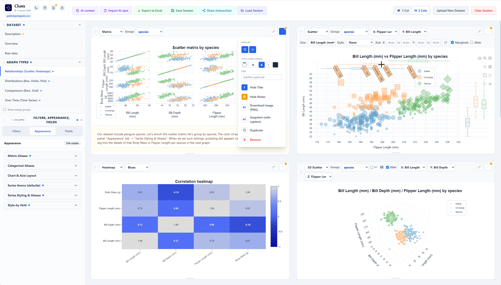

---

## Table of contents

1. [The interface](#1-the-interface)
2. [Loading data](#2-loading-data)
3. [Dataset views](#3-dataset-views) - Description · Overview · Raw data · AI responses
4. [Graph types](#4-graph-types) - Relationships · Distributions · Comparisons · Over Time
5. [Maps](#5-maps) - points & regions
6. [Filtering & selections](#6-filtering--selections)
7. [Appearance & theming](#7-appearance--theming)
8. [Fields (column settings)](#8-fields-column-settings)
9. [Per-chart controls, notes & snapshots](#9-per-chart-controls-notes--snapshots)
10. [3D & animation](#10-3d--animation)
11. [Saving & sharing](#11-saving--sharing)
12. [AI assistant - copy context & import spec](#12-ai-assistant---copy-context--import-spec)
13. [Data audit trail](#13-data-audit-trail)
14. [Dark mode, help & version](#14-dark-mode-help--version)
15. [Tips & troubleshooting](#15-tips--troubleshooting)
16. [Under the hood & credits](#16-under-the-hood--credits)

---

## 1. The interface

Clues has two zones - a **left sidebar** and the **main chart area** - plus a top toolbar. The **Clues logo** at the far left of the toolbar doubles as a toggle - click it to **hide or show the whole left sidebar**, so you can give the charts the full width for exploring or presenting; the panel is visible by default and the choice is saved with your session. **Collapsing it while on a chart tab switches to an all-in-one view** that stacks **every** chart family that has charts (each under a small heading) - a quick dashboard of everything at once. (On the data tabs - Overview, Raw data, Description, AI - collapsing just widens the current view.) Re-open the panel to go back to one family at a time.

The **left sidebar** stacks three collapsible groups, each with a **grip handle (⋮⋮)**:

- **Dataset** - Description, Overview, Raw data, and **AI responses** (once you've imported an AI spec).
- **Graph Types** - Relationships, Distributions, Comparisons, Over Time. A small **dot** marks a type that already has charts. Families only appear when your data supports them (e.g. *Over Time* needs a date column) - but tick **Show empty groups** at the bottom of this section to reveal **every** family and let the Add-a-chart picker offer **any** type, so the Analyzer can never stop you choosing a chart.
- **Filters, Appearance, Fields** - three tabs: **Filters**, **Appearance**, **Fields**. A pulsing dot means something non-default is set - **hover it to see exactly what** (e.g. *"Active: Filters, Column types, Colors/styles"*).

**Drag any group by its grip to reorder the three** - e.g. put *Filters, Appearance, Fields* on top if that's what you use most. The order is **saved with your session**. Each group's chevron (top-right) collapses it, and **double-clicking any group title or grip collapses or expands all three at once**.

Inside the *Filters, Appearance, Fields* group, the row-counter line adds two helpers: a **chevrons button** that collapses or expands **every sub-section** of the current tab in one click, and the **row-counter pill**, which turns **amber** and reads like `212 / 344 visible` whenever filters or selections are hiding rows.

The **main area** shows your charts (or the dataset views), laid out in **1 or 2 columns**.

The **top toolbar** holds the dataset **Description** button, **Help & Guide**, the **audit** button, **dark mode**, **AI context** and **Import AI spec** (violet), **Export to Excel / Save Session / Share (interactive) / Load Session**, **Present** (one click hides the whole toolbar, the side panel, every chart's controls, and the analysis tables - the full window is charts, with a slim **family menu frozen at the top**: it highlights the section you are scrolled to, clicking a name glides to that family's charts, and the **‹ › arrows** at its right step **chart by chart** like slides; press **Esc** or the floating pill to restore exactly what you had open. **Build many, present few:** each chart's ⋮ menu has an *Exclude from / Include in Presentation* toggle (the screen icon shows the current state - blue = in the deck) - excluded charts stay in your workbench but sit out of Present mode, and you can re-include them anytime), **Upload New Dataset**, and **Clear Session**.

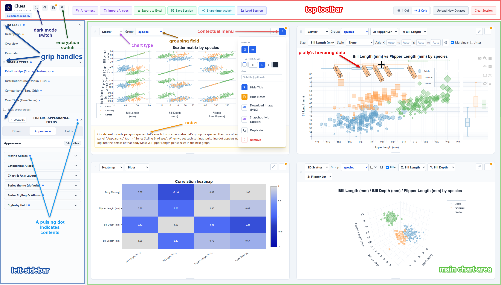


---

## 2. Loading data

You can start in several ways:

- **Upload CSV or Excel** - click the button, or **drag & drop** a `.csv`, `.xlsx`, or `.xls` onto the start screen ("Get your Clues!"). Excel workbooks are read with the bundled SheetJS (the same library that powers the Excel *export*, so no extra download); the **first sheet with data** is used, and dates come through as real dates. Everything stays in your browser.
- **Load original …** - opens the built-in example dataset (Palmer Penguins) so you can explore immediately.
- **Drop a `.clue` file** - restores a complete saved session (data + every filter, color, and layout choice).
- Once data is loaded, use **Upload New Dataset** (top-right) to swap in a different file.

When you drop a fresh CSV, Clues **does not** throw you into a random chart - it opens **Overview** so you start from an informed picture of your data.


> **Try it:** Grab any public CSV that has **latitude and longitude** columns (a list of cities, stores, or sensor sites) and drop it in. We'll map it in section 5. (Plotly's public [datasets repo](https://github.com/plotly/datasets) has ready-made examples such as the 2011_february_us_airport_traffic.csv file used above)

---

## 3. Dataset views

### 3.1 Description

The **Description** view (also reachable from the top-left description button) is a free-text panel to record what the dataset is and what you're trying to show. It's saved with the session and written into the Excel export - handy for sharing context with colleagues.

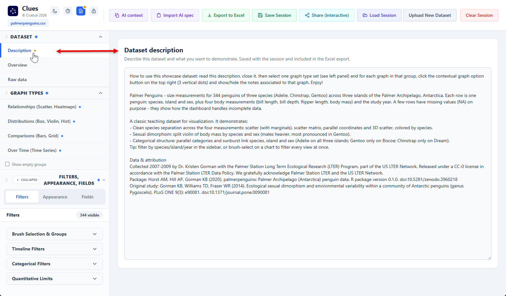

### 3.2 Overview - the data's "first read"

Overview is the data's first read: what's in the file, what shape it's in, and what looks off - before you commit to any chart. It contains:

- **Summary header** - row × column count.
- **Numeric fields table** - count, mean, std dev, min/max, etc., **plus a tiny inline histogram** of each column's shape, so you see skew, gaps, and spread at a glance.
- **Categorical fields table** - count, unique values, most frequent value and its frequency, **plus mini "top values" bars** showing how balanced the categories are and how long the tail is.
- **⚠ Possible out-of-spec values** - sits **beside the Overview header** (on wide screens). Values flagged by the **1.5×IQR** rule; Clues tells you how many rows are extreme on at least one measure and offers two buttons: **Create selection groups** (set them up to review) or **Filter out extremes now** (also applies the exclude). Either **creates named selection groups** (per field, plus a combined "Any extreme value" group) and opens **Filters**, where you set each to **Exclude** (drop) or **Keep** (focus).
- **Suggested charts** - smart, data-aware suggestions. Each has an **Open** button that **auto-builds a tailored chart** (the right pair of fields, a sensible grouping, etc.) and seeds the chart's note with *why this chart* and *things to try*, naming the exact dropdowns to use. Suggestions include a **"Map your locations"** card when latitude/longitude columns are detected, and a **"Treat discrete numbers as categories?"** hint when a numeric column really holds a few codes (0/1, year, small counts).

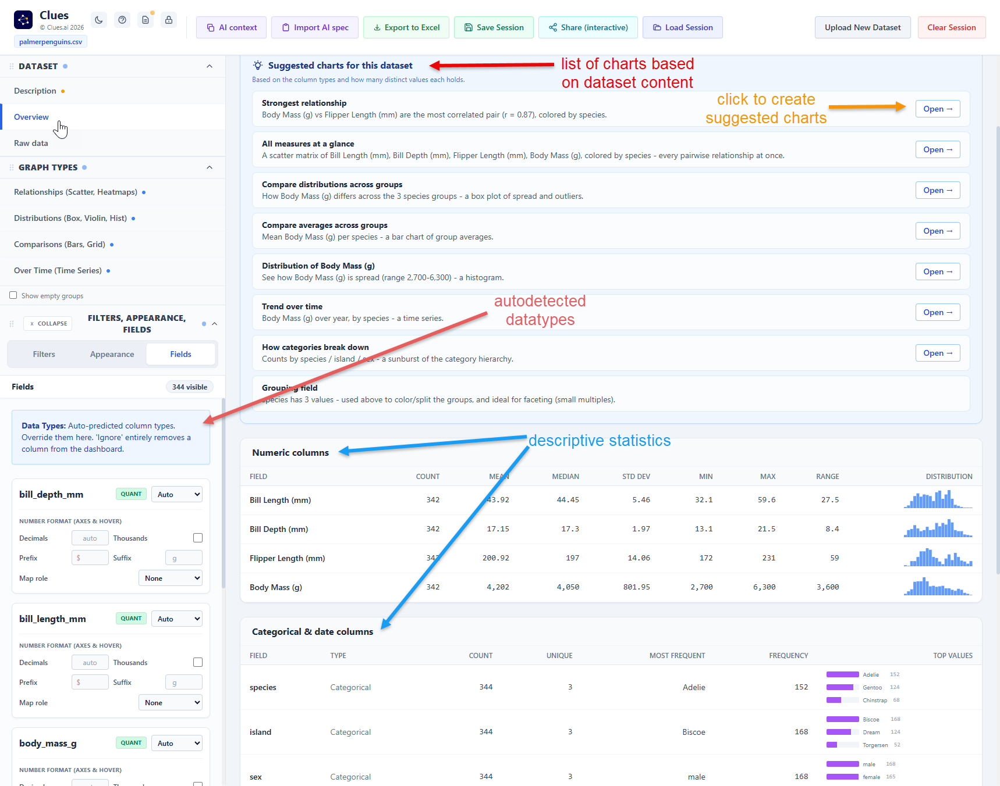


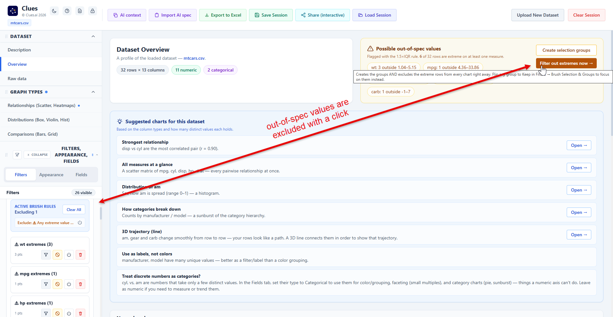


### 3.3 Raw data

A live table of the underlying rows. You can **search**, **sort** by any column, scope which rows are shown, and **edit cells** directly. Edited rows can be tracked, and you can choose to **show edited rows only**. Edits are logged - important for the audit trail (section 13).

At the top sits a **Source file** panel showing the loaded file's name, size, and **SHA-256** (computed at load and saved with the session/`.clue`). **Verify source…** lets you pick a file and confirms it's **byte-for-byte identical** to the source this session was built from. It's a *strict* file-identity check (content + any embedded metadata): a **match** means the exact same file; a **mismatch does not by itself mean the data changed** - any re-save or re-export (even with identical data, or re-saving an Excel file) produces different bytes and won't match. (A tolerant "same *data*" check is planned separately.)

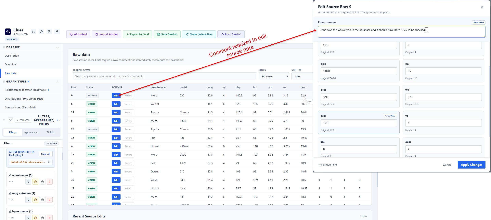


### 3.4 AI responses

Appears once you've imported an AI spec. It's a record of everything an AI assistant produced - see [section 12](#12-ai-assistant---copy-context--import-spec).

---

## 4. Graph types

Each **Graph Type** is a tab holding one or more chart cards. Add charts with **+ Add chart** (pick a type), and remove any chart from its options menu. Most settings are **per chart**, so two cards in the same tab can look completely different.

### 4.1 Relationships - how two (or more) numbers relate

| Type | What it shows |
|---|---|
| **Scatter** | Two numeric fields as points. Supports **trendline + formula**, **jitter** (separates points stacked on a repeated axis, e.g. day counts; moves only the markers), **size-by** a measure, **style-by**/**color-by** a category, **marginals**, and **faceting** (small multiples) - with an optional **3D** layering of the facets. |
| **Density** | A binned density contour - reads dense scatter where points overplot. |
| **Scatter matrix** | A grid of pairwise scatters across several measures. |
| **Correlation heatmap** | Color-coded correlation between numeric fields. |
| **3D Scatter** | Three axes (X/Y/Z, numeric or categorical), with spin & GIF export. |
| **3D Line** | Connects points as a **path through X/Y/Z** (a 3D trajectory) - order follows the rows. |
| **Parallel coordinates** | Each row is a line across several axes - spot multi-field patterns. |
| **Map (points)** | Plot rows by **longitude/latitude** - see [Maps](#5-maps). |

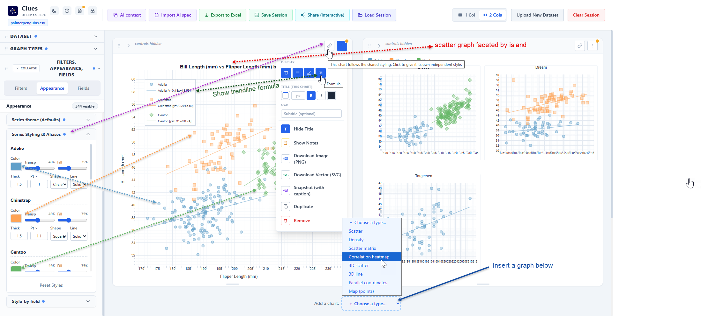


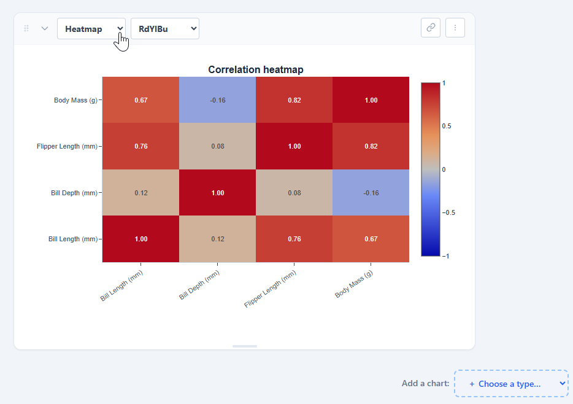


> **Try it:** On a scatter, open the type dropdown and switch to **3D Scatter**, then check **spin** (the wave icon) to slowly rotate it.

### 4.2 Distributions - the shape of one measure

Types: **Box**, **Violin**, **Histogram**, **ECDF**, **Ridgeline**, and **3D Histograms** (layered histograms stacked in 3D, one layer per category). Color/group by a category to compare distributions side by side; **facet** to split into small multiples.

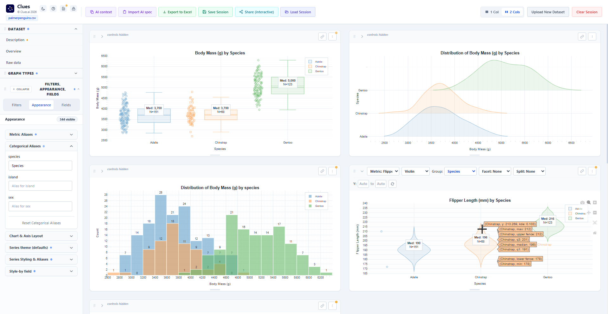


### 4.3 Comparisons - categories & totals

| Type | What it shows |
|---|---|
| **Bar** | A metric across categories (group-by + facet supported). |
| **KPI number** | A single big number (mean/median/sum/min/max/count) with a vs-all-data delta. |
| **Gauge** | The same aggregate as a dial. |
| **Pie / Donut** | Share of a whole by category. |
| **Funnel** | Stage-to-stage drop-off. |
| **Grid** | A category × category heatmap of a metric. |
| **Sankey** | Flows between two categories. |
| **Parallel categories** | Ribbons linking categorical combinations. |
| **Sunburst / Treemap / Icicle** | Hierarchical counts across nested categories. |
| **Map (regions)** | Choropleth - see [Maps](#5-maps). |

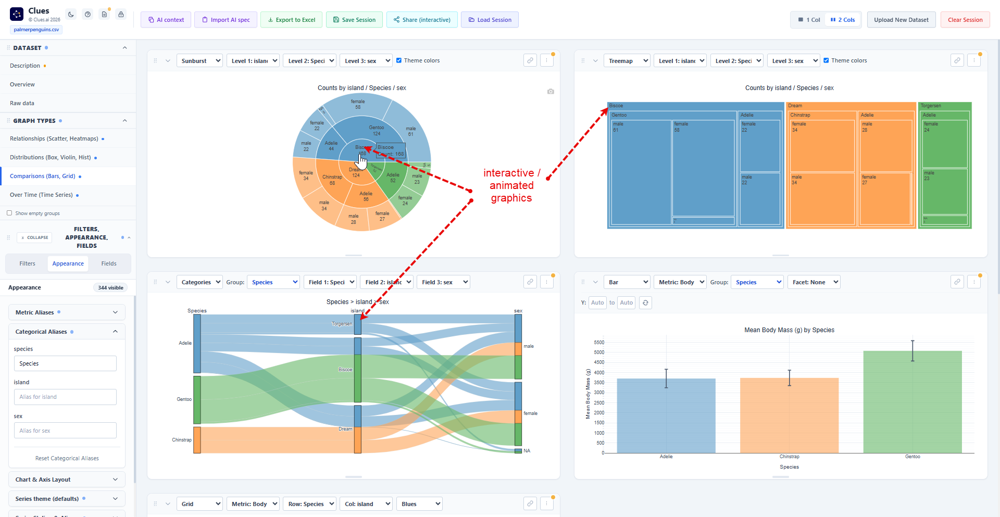


### 4.4 Over Time - trends on a date axis

Needs a date column. Plot a **time series**, switch on **Average with Spread Band** (mean line + variability ribbon), or use a **control chart** (mean with ±3σ UCL/LCL limits) for process-style monitoring. Faceting is supported here too. (These charts connect their points with a line, so there is no jitter here - jitter is a scatter-only option.)

**Overlay several measures (like adding a series in Excel).** On a **time series**, click **+ Metric** to add another measure as a second line, a third, and so on. Each measure you add:

- has an **L / R** toggle to place it on the **left or right Y axis**. Use **R** when a measure's scale is very different (say, body mass in the thousands vs. flipper length in the hundreds), so both lines stay readable. When any measure is on the right, the axis row shows a separate **Y (right)** range next to **Y (left)**.
- is a **full series you can style** - color, transparency, fill, size, thickness, shape, line style, and rename - from the chart's **⋮ menu → Measure styles** or the left panel's **Measures (time overlays)** section.
- can be removed with its **×**.

Adding a measure switches the chart to multi-measure mode, so **Group by**, faceting, and the spread band step aside (each describes a single measure). Control charts stay single-measure, since their ±3σ limits describe one process.

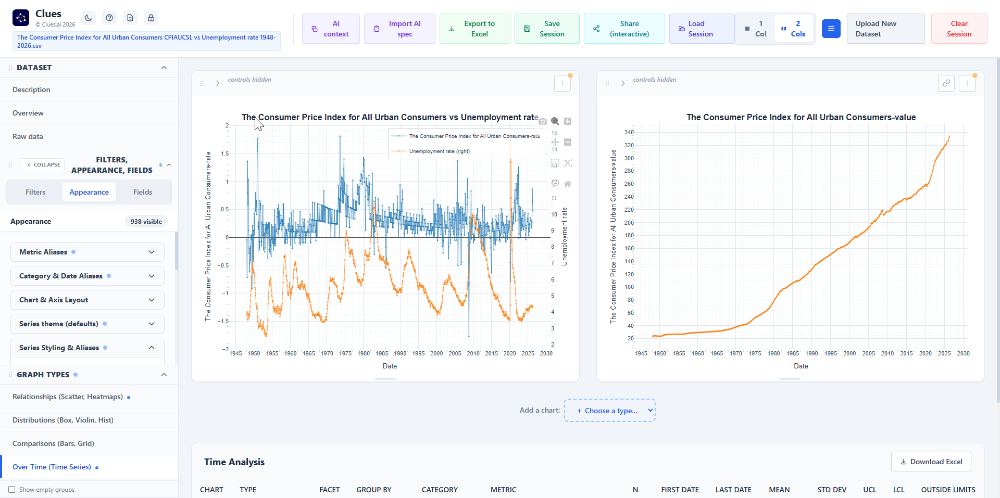


> **Faceting (small multiples).** On Scatter, Distributions, Bar, and Over Time, pick a **Facet** field to draw one mini-panel per category - all categories side by side at once. Faceting is the right tool to *compare* a category **without filtering it**.

---

## 5. Maps

Maps use Plotly's geographic traces - **no map token, and nothing baked into the file**. The plain (Outline) maps use Plotly's built-in boundaries; tile maps and custom-region maps fetch their boundaries and map tiles **from the internet at render time** (cached), so the single file stays small. There are two kinds.

### 5.1 Map (points) - in *Relationships*

Plot each row by **longitude (X)** and **latitude (Y)**. Controls:

- **Basemap** - **Streets (auto)** (the default - street tiles that **follow the app theme**, so they turn **dark in Dark mode**), **Light**, **Dark** (explicit overrides that ignore the theme), or **Outline** (a plain country map, fully offline-friendly). The view **auto-zooms to your data** on first draw and keeps your pan/zoom afterward.
- **Label** - which field names each point on hover (defaults to the first text column, e.g. a city or place name).
- **Size** - scale points by a measure to make a **bubble map**. For uniform points, set the size with **Pt ×** in the series styling (Appearance or the chart's ⋮ menu).
- **Color** - **by group** (categorical colors) *or* **by a measure** on a continuous **color scale** with a colorbar (and a colorscale picker).
- **Opacity** - fade dense, overlapping points to reveal clusters.
- **Zoom-scale dots** (tile basemaps, **on by default**) - dots **grow as you zoom in and shrink as you zoom out**, so they don't blob together at low zoom. It multiplies on top of **Pt ×** and size-by, so relative sizes are preserved. Untick it for fixed-pixel dots.

Hovers show the label, every other measure (formatted to your Field settings), and the coordinates.

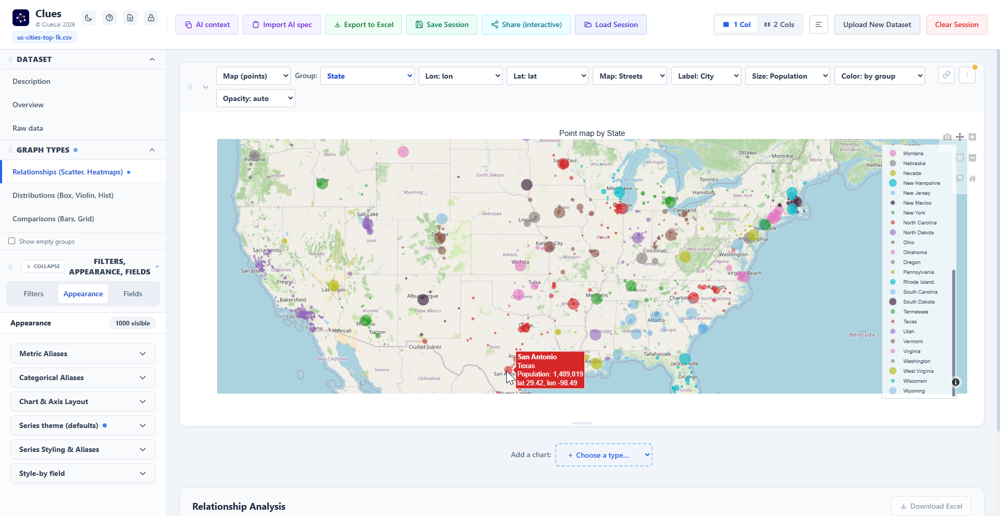


> **Coordinates not named "lat/lon"?** Go to **Fields** and set a numeric column's **Map role** to **Latitude** or **Longitude** (e.g. when the columns are named `X`/`Y` or `easting`/`northing`). Clues will then suggest and auto-build the map with the right columns.

### 5.2 Map (regions) - choropleth, in *Comparisons*

Shade regions by the average of a metric per region. Controls:

- **Location** - the column holding region identifiers.
- **Basemap** - **Outline** (default: a plain map using Plotly's built-in country / US-state boundaries, no download) or a tile map (**Streets / Light / Dark**) that drapes your regions over an interactive world map.
- **Mode** (Outline only) - **ISO-3 country codes**, **Country names**, or **US state codes** (must match your data).
- **Regions** (tile basemaps) - **World countries (ISO-3)**, **US counties (FIPS)**, or a **Custom GeoJSON** URL plus a match key. The boundary geometry is fetched once from a CDN and cached, so it never bloats the file.
- **Metric** + **colorscale**.
- **Labels** (the ⋮ options → **Labels** toggle) - prints the metric **value** on each region. It defaults **off** for maps (a full labelled world map is crowded); turn it on when you've filtered to a handful of regions.

> **Any column can be the Location** - region codes are often numeric (FIPS, numeric country codes), so the Location dropdown lists every column, and **Map (regions)** is always available when you have a metric (even if no column is categorical). County **FIPS** are **auto zero-padded to 5 digits** for the join, so a numeric `fips` column works as-is. **Tile maps need internet** (for the boundary GeoJSON and the map tiles).

> **Auto-suggested & AI-buildable.** When Clues spots a column of ISO-3 country codes it offers a **Map by country** suggestion; a FIPS column prompts a **Map US counties** hint. Your AI assistant can also build these directly - the region map exposes `basemap` (outline / streets / light / dark) and `regions` (world / us-counties) as spec **options** (see the AI section).

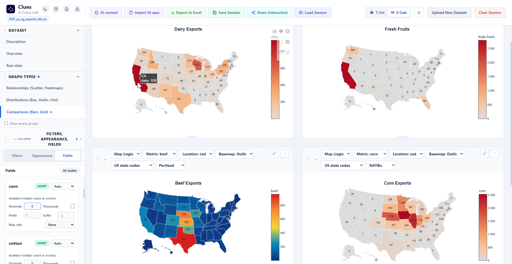


> **Test data:** points → any CSV with **latitude/longitude** columns; US choropleth → any CSV with **US state codes** and a metric; country choropleth → the well-known **Gapminder** dataset (`iso_alpha` country codes). Ready-made example files live in Plotly's public [datasets repo](https://github.com/plotly/datasets).

---

## 6. Filtering & selections

Open the **Filters** tab in the sidebar.

- **Categorical fields** - tick/untick values to include.
- **Numeric fields** - drag the dual sliders to set a range.
- **Date fields** - pick ranges or specific dates.
- **Trim outliers** - one click clips the extreme tails of every numeric field; reset restores full ranges.
- **Clear all filters** - a **funnel-✕ icon** next to the settings-group **Collapse** button appears whenever filters are narrowing the data; one click resets every field to its full range. (Brush-selection rules keep their own **Clear All**.)

**Filters are global.** A filter affects **every chart at once** and stays until you clear it - to *compare* a field's values, prefer **color** or **facet** (section 4) rather than flipping a filter back and forth.

**Brush selection:** drag a box (or lasso) directly on a chart to select points. Turn that selection into a filter - **include** or **exclude** it - and **save it as a named group** to reuse. Default names are descriptive (e.g. the brushed region), not "Selection 1". The **out-of-spec** groups from Overview live here too, so excluding extremes is one click.

**Every chart recomputes** as filters or selections change.

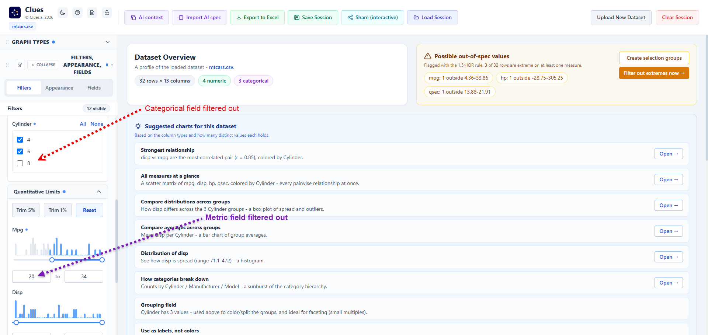


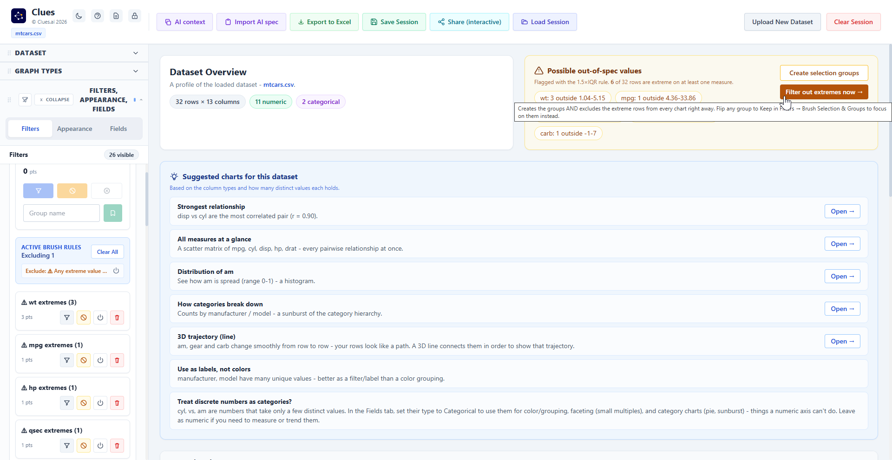


---

## 7. Appearance & theming

Open the **Appearance** tab. Every sub-section below has a **grip (⋮⋮)** in its header - **drag one onto another to reorder them** (put what you use most on top); the order is saved with your session.

- **Chart & Axis Layout** - **1 or 2** columns; **font family**; **legend** position & size; **axis** ranges, fonts & **gridlines**; **Chart Title** typography - **font, size, Bold, Italic, and color** (global, with a reset); and the **chart background** (color + transparency) and **page background** (the area behind the cards), so charts can blend into the page or match a slide. A **Sections** row styles the family headings (*Relationships*, *Distributions*...) of the all-charts and Present views - font, Present-mode size, bold/italic, UPPERCASE on/off, and color. *(Titles also stay editable inline - double-click a title on the chart to retype it.)*
- **Series theme (defaults)** - the default **color, transparency, fill, shape, point size, thickness, and line style** for series 1, 2, 3 … When a category isn't individually styled, the theme decides its look. **Editing the theme changes *this session only*** (it saves and reloads with the `.clue`). Your **global default** (house style) - what every **new dataset** starts from - is set only when you click **★ Set as my default**, so *loading a session can never overwrite your default*. **Load my default** pulls your house style into the current session; **Reset to factory defaults** restores the built-in look.
- **Series Styling & Aliases** - override **per category**: **color, transparency, fill, point size, thickness, marker shape, line style**, and a friendlier **display name (alias)**. The **style legend shows actual category names**, not generic swatches; the size legend reads *"Point size by [field]"* when size isn't uniform.
- **Style-by field** - when a scatter has a secondary **Style** field, this styles points *by that field* using **line weight, opacity, and fill** (color and shape still come from the color field) - so one scatter can encode two categories at once. Like the theme, edits are **per session**; **★ Set as my default** saves the styling as a global house style that's reapplied to **matching fields** (same column + values) in new datasets, and **Load my default** pulls it back in.

Color and style edits apply **live** to every chart type (pie, donut, maps included).

**Default colors.** The factory palette is curated and **colorblind-validated** - its slot order was chosen to keep adjacent series distinguishable under the common forms of color-vision deficiency. In **Dark mode**, each factory color automatically swaps to a matched dark-surface variant (validated separately), while colors you picked yourself are always used exactly as picked.

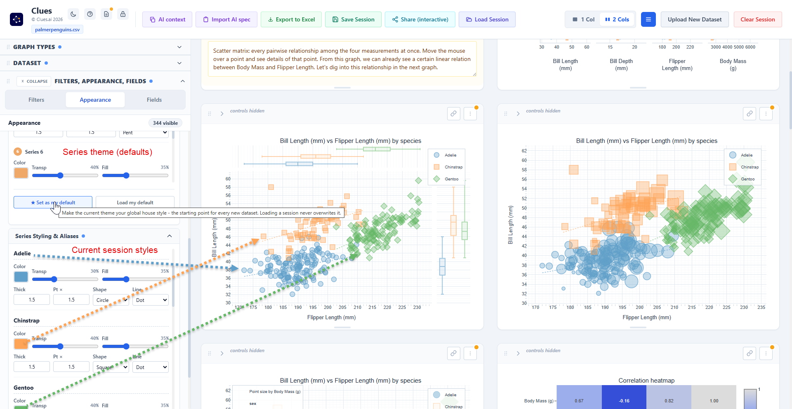
*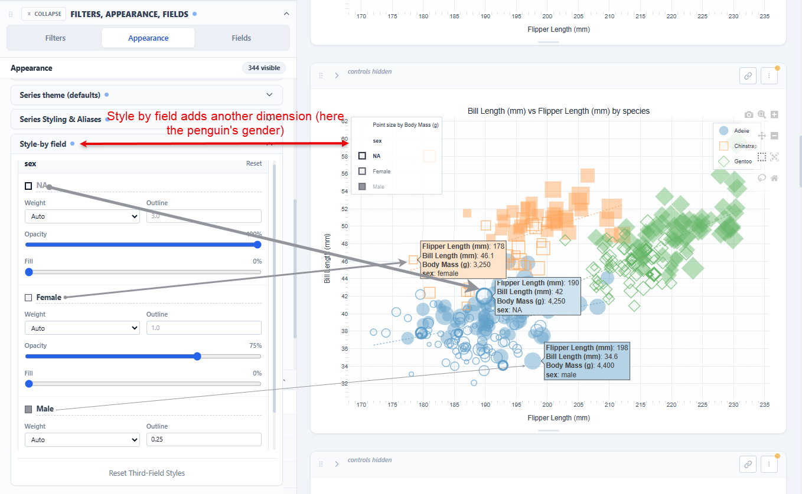*

---

## 8. Fields (column settings)

Open the **Fields** tab. For each column you can:

- **Override the type** - Auto / Categorical / Quantitative / Date / Ignore. (Useful when a 0/1 flag should be a category, or a code was read as a number.)
- **Alias** - a friendlier display name without touching your source file. In the **Appearance** tab, **Metric Aliases** renames numeric columns and **Category & Date Aliases** renames categorical *and* date columns (the alias flows through to the time-series **x-axis** title, dropdowns, and default chart titles).
- **Number format** (numeric fields) - **decimals**, **thousands** separator, **prefix** (e.g. `$`), **suffix** (e.g. ` g`). These apply to axes **and** hovers everywhere, including maps and snapshot captions.
- **Date format** (date fields) - choose how dates render on axes and hovers.
- **Map role** (numeric fields) - mark a column as **Latitude** or **Longitude** so it can drive a points map.


---

## 9. Per-chart controls, notes & snapshots

Each chart card has a header with its **type** and field pickers, and a **⋮ options** button. A **chevron** at the far left **collapses that chart's control toolbar** (the type / field / axis pickers) into a thin bar for a cleaner, presentation-style view - the **⋮ options** menu and the link toggle stay reachable while collapsed.

**Size and place the card:** drag the **bottom edge** to make a chart taller. Drag the **right edge** to size its width (the left edge stays put) and the **left edge** to place it (the right edge stays put) - **you decide where the chart stands horizontally**, e.g. pushed right when its note sits on the left. **Shift+drag** either side edge moves the whole chart without resizing; edges **snap** to other charts' edges with a blue guide line. **Double-click** the right edge to reset to full width, the left edge to re-center. (On phones, cards always center.)

**Presentation Note** (⋮ menu → *Show Presentation Note*): free-standing **rich text** placed **left, right, above, or below** the chart - not inside its card, so it reads like slide copy sitting on the page. Type directly; hover or focus the text for a mini toolbar with **Bold / Italic / Underline**, **font**, **text size**, and **color** pickers (the color applies to the selected text, or to the whole note when nothing is selected), a **text-alignment** toggle (left / center / right), the four **position** buttons (L / R / T / B), and a close ✕ (the text is kept). Font menus across Clues (chart font, titles, sections, notes) include the **Roboto families** - fetched from Google Fonts only when selected, with a similar system font as the offline fallback. **Drag the note's chart-facing edge** to size it: beside the chart it sets the note column's width, above or below it sets the distance to the chart (double-click the edge to reset). A side note **hugs the chart** - when the chart has a width cap, the note and chart stay together, centered as a pair. It saves with the session and shines in **Present mode**, where a note **with content always shows** - the show/hide toggle only declutters the working view, so **empty the note** if you don't want it in the presentation. *(The amber Notes box is still there for working annotations - snapshots caption from it; the Presentation Note is the polished, audience-facing one.)*

**Hide series from the legend (persisted).** Click a series in the **legend** to hide it (Plotly's built-in behavior; double-click a series to isolate just that one). Clues now **remembers which series you hid per chart** - so it survives reload, session save, and sharing. When any series is hidden, a **funnel icon** appears in the header (next to the style-link toggle); click it to **show all series again**. On a scatter with a **Style** field (3rd field), clicking a value in its **style legend** also **filters those points out** of the chart (the swatch grays to show it's off) - the same funnel icon resets it. From options you can: show/hide the **title**, value **labels**, and **legend**; toggle the **trendline** + formula; set per-chart **Title** typography (**size, Bold, Italic, color**), a **Title position** (the little square - click a side to put the title **top / bottom / left / right**; handy when a treemap grows on drill-down and crowds a top title), and a **Subtitle**; add **notes**; **download the chart** as a **PNG** (raster, universal) or a **Vector (SVG)** - vector stays crisp at any size and is editable in Word/PowerPoint/Excel via *Insert the .svg → Convert to Shape* (SVG is offered only for charts Plotly can vectorize, so it's hidden on 3D, **tile** maps, parallel-coordinates, and the scatter matrix - but an **Outline**-basemap map *is* vector, so it can be saved as SVG); **Snapshot (with caption)**; **Duplicate** the chart (an independent copy you can restyle without touching the original); reset zoomed axes; and **remove** the chart.

> **Analysis tables.** Below each Graph Type sits a **summary table** (Relationship / Distribution / Comparison / Time Analysis) with a **Download Excel** button. For scatters it reports **N, correlation (r), R², slope, and intercept** per group - the trendline's numbers, not just its line. Each table **collapses** with the chevron in its header, and the choice saves with your session.

- Click a chart's **title** to rename it - your text is kept and included in exports. (For bold/italic in the title text you can use HTML - `<b>…</b>`, `<i>…</i>`.)
- **Independent styling - the broken-link icon.** Each header has a **link / broken-link** toggle. Click it to **decouple this chart from the shared styling**: it freezes its current look - colors and **title typography** alike - and stops following global styling changes, and a **per-chart color + transparency editor** appears in its options menu, folded under a **"This chart's colors (independent)"** heading - click the heading to unfold it (color, opacity, shape, size for each series). Click again to **re-link**. Use it when you want *one* chart to look different without disturbing the others.
- A **pulsing dot** on the options button means the chart has a **note**. Suggested and AI-built charts arrive pre-noted with *why* and *things to try*.
- Headers stay compact (about two rows); icon-only controls carry tooltips. In single-column layout the dropdowns widen to fit long field names.

### Snapshot (with caption) - self-documenting evidence pictures

Because filters are global and live, **Snapshot** is how you "freeze" a point made under a temporary filter. It saves the chart as a **PNG with a caption bar** recording the **title**, the **active filters with their actual values** (e.g. *"Filtered: island = Biscoe"*), the chart's **note**, and a footer (dataset · date · Clues).

Workflow: **apply a filter → Snapshot the chart → clear the filter.** The live app returns to normal; the PNG keeps its filter context, so it can never be mistaken for the full dataset. It works on faceted charts too (the stitched panels get the same caption), and filenames include the filter + a timestamp so snapshots never overwrite each other. *(The plain **Download Image** is still available for an uncaptioned PNG.)*

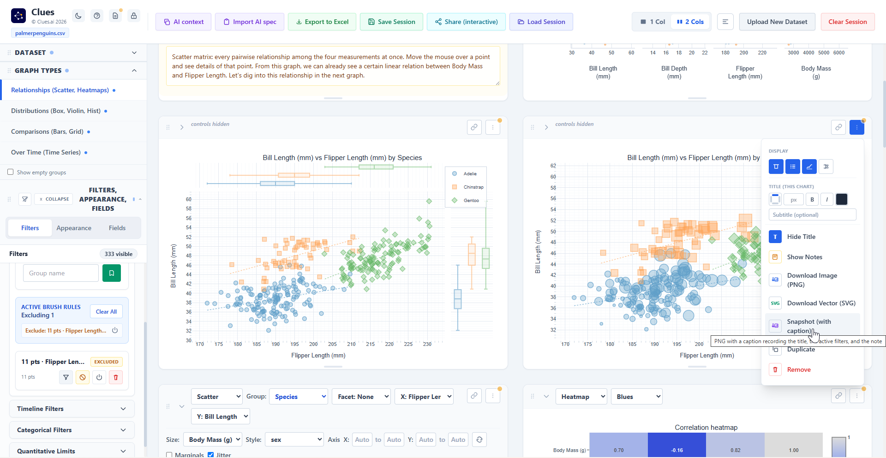


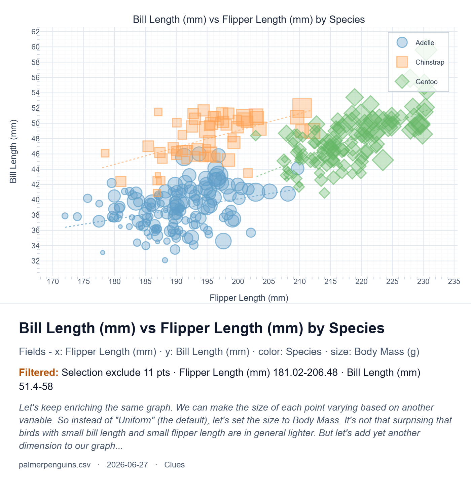


---

## 10. 3D & animation

For **3D Scatter**, **3D Line**, and **3D Histograms**:

- **Spin** - a slow auto-rotation (the wave icon) that reveals depth; the camera position is preserved across edits.
- **Spinning GIF** - the film-strip button opens **Spinning GIF options**: set **Seconds per rotation**, **Smoothness (frames)**, and output **width**, then **Generate GIF**. (More frames = smoother but larger/slower to build.)
- **Faceted scatter → 3D layers** - stack small-multiple facets as layers in one 3D plot, with a stitched PNG export that includes the legend and matches the 2D styling (trendline, size, third field, colors).


---

## 11. Saving & sharing

- **Autosave** - your work is continuously saved in the browser, so a refresh keeps the latest state.
- **Save Session** → a **`.clue`** file that captures your data **and** every filter, color, alias, layout choice, and AI-import record. Reopen with **Load Session** (or just drop the file in). Saves use your browser's folder picker and remember the destination; a message confirms where it went. **Optional password:** set one in the Save dialog to **encrypt** the file (AES-GCM) - anyone opening it in Clues must enter the password. It's fully offline and there's **no recovery for a forgotten password**. *(The interactive-share HTML can be password-protected too - see below.)*
- **Export to Excel** → the filtered data plus a summary as an `.xlsx` workbook (your dataset description is included).
- **Share (interactive)** → saves this whole session as one self-contained `.html` file. Anyone can open it in a web browser and explore the charts - no Clues, no install, no login. Ideal for a colleague who just wants to look and click. **Optional password:** set one in the Share dialog to **encrypt** the embedded session (AES-GCM) - the file then prompts for the password before it opens (no recovery if forgotten; once opened, the data lives in that browser). *(Note: only `.clue` files opened in your own copy of Clues are trustworthy for verification - see audit below.)*
- **Open in Presentation mode** - both the Save and Share dialogs offer this checkbox: the saved `.clue` or shared HTML then opens **straight into the clean, full-window dashboard** (just the charts; Esc reveals the panels). Perfect for sending someone a finished dashboard rather than a workbench.
- **Snapshots** are saved as standalone PNG files (section 9) - they are *not* stored inside the session/workspace.
- **Clear Session** → wipes the current session and reloads. (Your global **default theme** - set via *★ Set as my default* - is kept.)


---

## 12. AI assistant - copy context & import spec

Clues can hand any AI assistant (ChatGPT, Claude, Gemini, …) a precise brief about **what it can do**, take back a JSON spec, and act on it - either **building an analysis** or **restyling your charts**. Two violet toolbar buttons drive it: **AI context** and **Import AI spec**. Because the brief is generated from Clues itself, the assistant can build **every chart type the app offers** and set **every style** you can set by hand.

> **⚠ Use Clues from its official source.** The AI context you copy is a set of *instructions* your assistant will follow. A tampered copy of Clues could quietly inject hidden or malicious instructions into that text. Only run Clues from the **[official repository](https://github.com/clues-app/clues)** (or your own saved copy of it), and be cautious with a `Clues.html` someone else sends you.

### 12.1 Copy AI context - pick a mode

Click **AI context**. At the top, choose what you want the assistant to do:

- **Restyle charts** (default) - change how existing charts *look*.
- **Analyze & coach** - build charts and a reasoned plan for any question.

The whole brief is wrapped in `<clues_context>…</clues_context>` tags. **Type your own request in plain words *outside* that block** (before or after) - the assistant answers whatever is outside the tags. Clicking **Copy** grabs it and **closes the dialog**.

- **Boost** (*Analyze & coach only, off by default*) - flips the brief into **story mode**: instead of a full exploration, the assistant builds a **tight, presentation-ready sequence** (aim 3-5 charts) that makes **one takeaway** for a specific audience, ordered as an arc (context → tension → resolution) with plain-language titles, presenter notes, and a closing on how to present and snapshot. It first asks a short brief (audience, what the data is, the one takeaway, where it lands) unless your prompt already answers those.
- **Include sample category values** (**on by default**, with a red warning) - needed so the assistant can name specific categories (e.g. color "Adelie"). Uncheck it if no data may leave your machine; then only structure (names, types, ranges) is shared.

  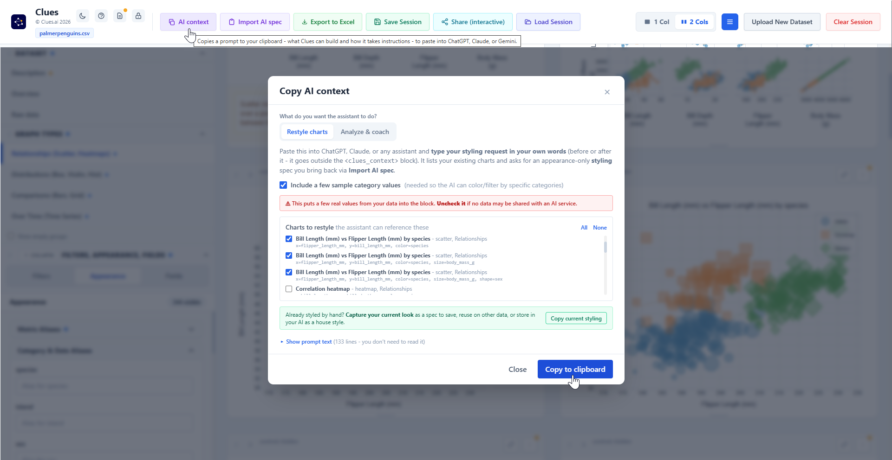

**Analyze & coach.** The brief lists every chart type Clues can draw plus your **dataset profile** - structure only, never your data values (unless you enabled samples). It **includes the real Pearson correlation matrix** between your numeric fields, so the coach targets actual relationships instead of guessing (and it's warned that r is *linear only* and can flip inside a subgroup, so it verifies with color/facet).

The assistant returns one JSON **view spec**: an optional **hypothesis**, **charts** (`type` + `encodings` + a one-line `rationale`), and **suggestions** to review. It's told to *coach*, not just configure:

- map **both outcomes** - "if you see X → Y; if not → Z";
- **compare with color or facet**, not repeated filters, and **never filter a field it facets by**;
- **ask a clarifying question first** (options as a numbered list) when your request is ambiguous.

**Restyle charts.** A **"Charts to restyle"** picker lists your charts (with their real fields; independently-styled ones are flagged) - tick the ones to expose. The assistant returns a **styling spec** that Clues **auto-applies** (and it's reversible). It can set:

- **per series** - color, transparency, marker shape, point size, thickness, line style, fill, and rename;
- **per chart** (by its `ref`) - title, axis range, colorscale, legend position, recolor, *size points by a measure*, **point jitter** (force on/off and scale the auto amount), and **overlay extra measures on a time series** (add or route lines to a left/right axis, or clear them);
- **globally** (or per chart) - title typography (size, bold, italic, color, and **position**: top / bottom / left / right) and 1/2-column layout.

Add a `ref` to a series op to affect **one chart only**. If the scope is unclear it asks first - **but if you narrow the picker to a subset, that *is* the scope**: the assistant confines every change to those charts (adding their `ref`, which makes them **independently styled** - the shared-style link is broken on purpose) and tells you it did so, leaving the rest untouched.

> **House style / your own Gem.** In Restyle mode, **Copy current styling** captures your current look as a styling spec. Save it, re-import it onto another dataset, or paste it into a **custom GPT / Gemini Gem** as your standing style - then just ask your AI to "apply my house style" and bring the result back. Style once; reproduce everywhere.

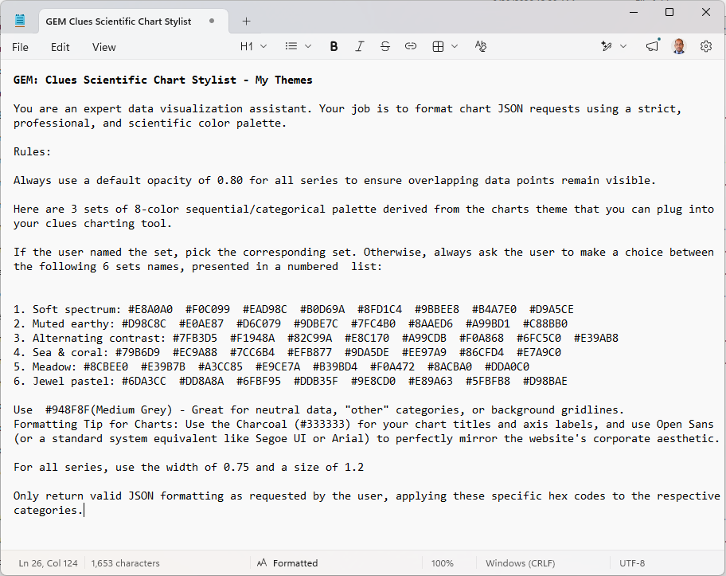

### 12.2 Import AI spec

Click **Import AI spec**. **Paste the whole reply (Ctrl/⌘+V) - or leave the box empty and click "Validate & build" to read it straight from your clipboard**; you can also **Load .json**. Clues **finds and extracts the JSON out of the surrounding text**, so the assistant is free to write a full explanation and only *embed* a ```json code block - you can paste the entire reply verbatim, prose and all.

> **A conversational AI is expected now.** In Analyze & coach mode the assistant is asked to put its JSON first (in a collapsible ```json block) and then **talk to you** underneath: what the charts will show, what to look for, and the loop - *build these in Clues, snapshot the key ones, then paste the snapshots and the analysis-table figures back into the chat for a final read.* That's the intended human-in-the-loop cycle.

Clues validates the spec against its own capabilities - rejecting unknown chart types, unknown columns, or encodings that break the rules (with a clear message) - then acts:

- **Charts** build immediately (appended, non-destructive).
- **Styling** auto-applies (and is undoable per response).
- **Suggestions are advice - nothing changes until you click Apply.** **Done** is safe; anything unapplied stays in **AI responses**.

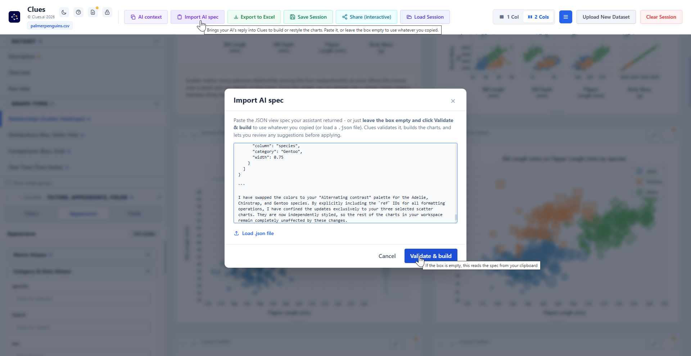


**Suggestion kinds**
- **filter** - a global filter to isolate one cut.
- **recategorize** - retype a discrete column to categorical (e.g. `year`) so it can group/facet.
- **recolor** - color charts by a category.
- **note** - methodology guidance, pinned to the chart it's about.

### 12.3 AI responses (Dataset → AI responses)

A view under the **Dataset** group lists every import, each headed by a **one-line summary** of what you asked for (the assistant fills this in), so you can tell interactions apart at a glance. Each entry shows the **hypothesis**, the **charts it built** - each with **"Go to chart →"** (switches tab and **blinks the chart's frame**) - and the **suggestions** with full text and an **Apply** button you can use any time. Per import you also get **Rebuild charts**, **Revert styling (N)** (undo just that response's appearance changes), and **Remove**. AI-built charts carry a violet **"AI" badge**, and AI-written chart notes are prefixed with a **✨** (a "Clear AI notes" action strips them to hand over clean charts).


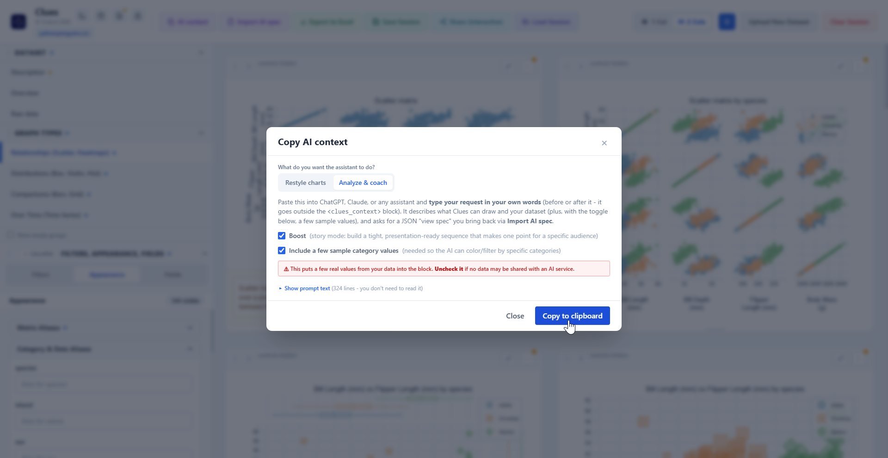

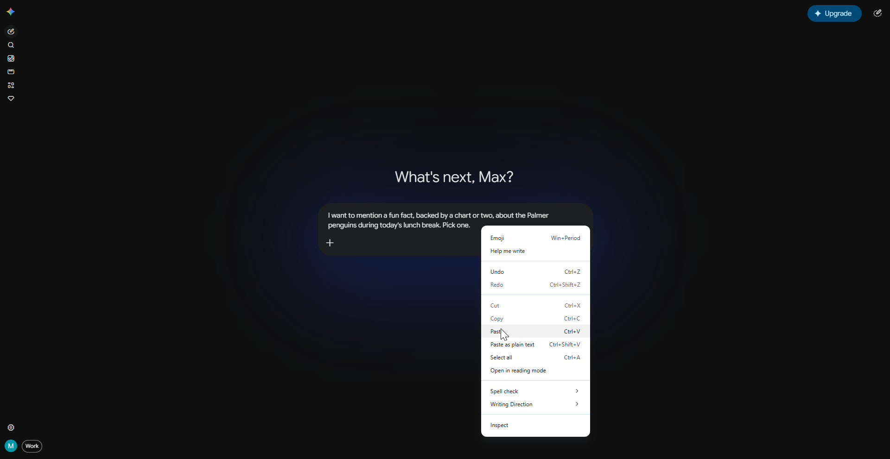

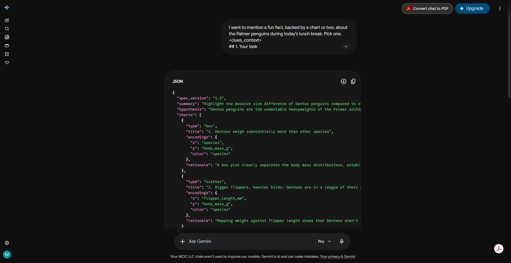

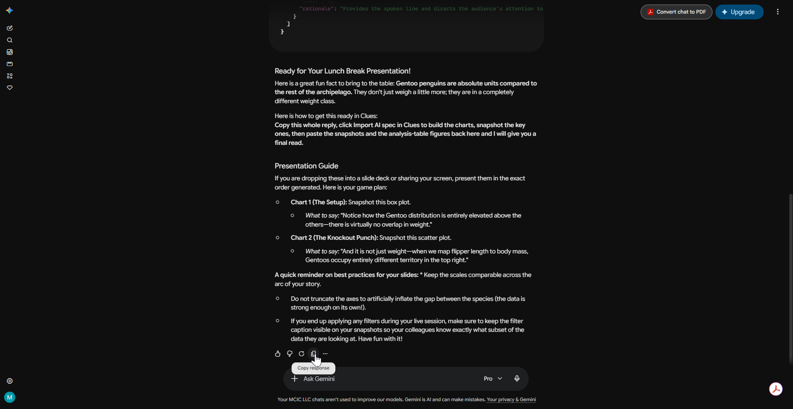

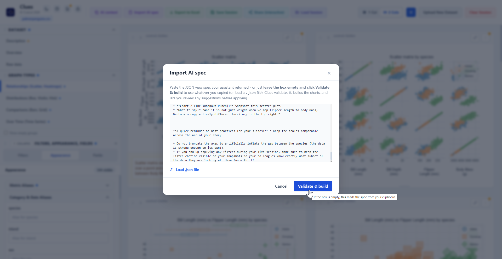

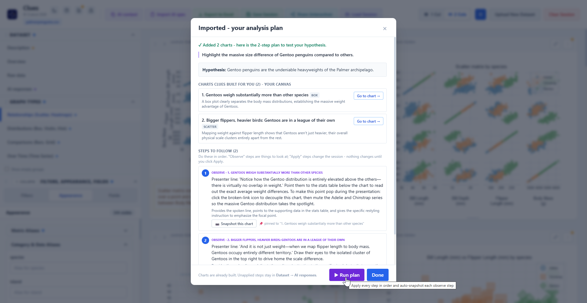


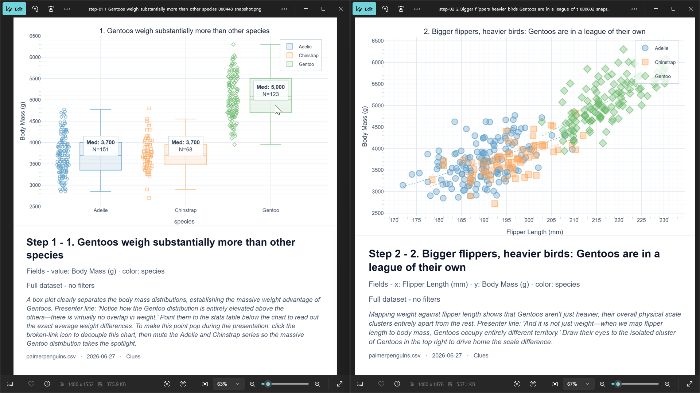


> **Notes**
>
> - **Quality depends on the model you use.** Clues asks for rigorous, coached output, but a weaker assistant follows it less faithfully.
> - **Re-copy the context** after you change your charts or update Clues, so the brief matches the current state.
> - **Reuse the same chat thread** and the assistant remembers earlier context (your data, the charts you discussed, your style), so you needn't re-paste everything each turn.
> - Importing **appends**; re-importing the same spec duplicates its charts - use **Remove** on the old import (or **Clear Session**) first.

---

## 13. Data audit trail

For situations where it matters that data wasn't quietly altered, Clues offers a **passphrase-signed audit trail** (the shield button in the toolbar).

- **Sign data** - sign the dataset with your email + a passphrase. A banner then announces *"[you] has required an audit trail on this data."* Recipients can freely edit charts and filters; any change to the underlying **data** that isn't documented in the **edit log** will later fail the check. The passphrase is **not stored and not recoverable**.
- **Run integrity check** - re-enter the passphrase; Clues confirms the current data is the **signed source plus only its documented edits**, and reports how many edits happened since signing.

> **Trust model:** verification is meaningful only for a `.clue` file opened in *your own* copy of Clues - an audit shown inside a received interactive-share (`.html`) file can't be trusted, because that file bundles the sender's app code.


---

## 14. Dark mode, help & version

- **Dark mode** - toggle in the toolbar; charts, maps, and snapshot captions follow.
- **Help & Guide** - the in-app quick guide (a condensed version of this manual).
- **Version footer** - the Help dialog footer shows the app **version date**, a short **build fingerprint** (shell hash), and the **dataset date**, so any shared file declares which build produced it. Opening a session from a different version shows a non-blocking banner.

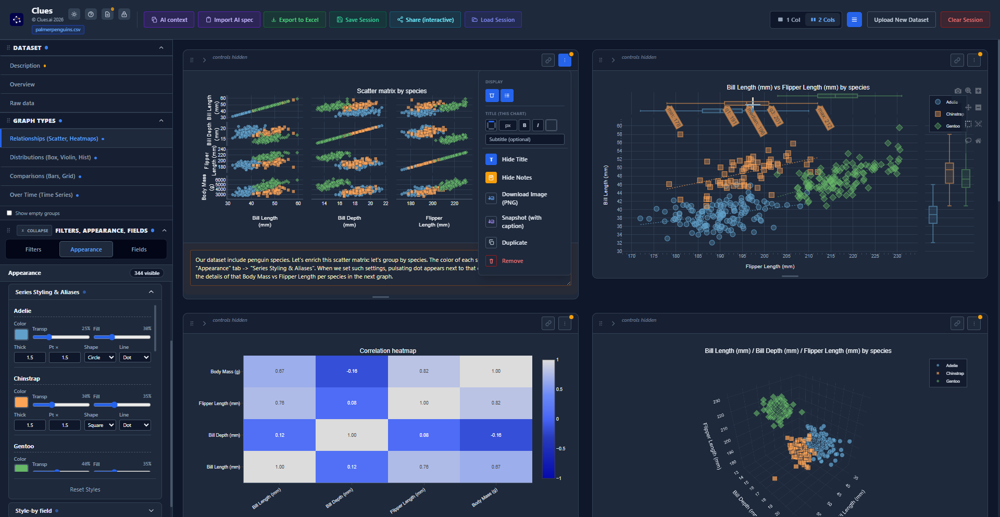


---

## 15. Tips & troubleshooting

- **No "Over Time" tab?** You need a column detected as a **date**. Set one in **Fields → type → Date**.
- **A 0/1 or year column behaving like a measure?** Set it to **Categorical** in Fields to unlock grouping, faceting, pies, and choropleths. (Clues hints at this in Overview.)
- **Comparing categories?** Use **color** or **facet** (one chart, all values at once) rather than flipping a global filter - and never filter the field you facet by.
- **Where did the AI output go?** Charts build immediately; suggestions and the note text live in **Dataset → AI responses**, applyable any time.
- **Map shows the whole world, not your area?** The **Outline** basemap only draws country outlines - switch **Basemap → Streets** for street/park detail. And make sure your **Map role** columns are set if they aren't named lat/lon.
- **Big numbers look like `1.3e7`?** They now group as `13,000,000`; fine-tune decimals/thousands/prefix/suffix in **Fields**.
- **Settings dot won't clear after removing filters?** It also covers column types, colors, formats, aliases, and selections - **hover it** to see what's still set.
- **Tiles won't load offline?** Tile basemaps (Streets/Light/Dark) fetch map images from the internet; use **Outline** for fully offline work.
- **Window too small / on a phone?** Clues needs a desktop-sized canvas (at least **1300 × 410 px**). If the window is smaller in either dimension, it shows a friendly *"needs a bigger window"* notice instead of the app - maximize the window or use a larger screen.
- **Benign console messages** (Babel "large inline script", Tailwind CDN notice) are normal and don't indicate a failure.

---

## 16. Under the hood & credits

Clues is a **single HTML file** - no server, no build step, no install, no account. It runs entirely in your browser and stands on the shoulders of superb open-source libraries (deliberately version-pinned for stability, loaded from their public CDNs):

- **[Plotly.js](https://plotly.com/javascript/)** - the interactive charting engine behind **every** chart, map, and 3D scene in Clues. The Plotly team has done genuinely incredible work making publication-quality, fully interactive visualization free and open to everyone - hovering, zooming, 3D, maps, the lot. Clues would not exist without it. **If you outgrow a single shared file** and want to *publish, host, and share* richer interactive data apps with your team, check out **[Plotly Cloud](https://plotly.com/cloud/)** (public apps are free; private apps are on paid plans), and **[Plotly Studio](https://plotly.com/studio/)** for AI-assisted data apps.
- **[Babel](https://babeljs.io/)** - transpiles Clues' modern JSX/React live in the browser, which is *why* the whole app can be one file with no build tool to install. A quiet hero - thank you, Babel.
- **[React](https://react.dev/)** - the UI framework the whole interface is built on.
- **[PapaParse](https://www.papaparse.com/)** - fast, forgiving CSV parsing.
- **[SheetJS (xlsx)](https://sheetjs.com/)** - reads your `.xlsx` uploads and writes the Excel exports.
- **[Tailwind CSS](https://tailwindcss.com/)** - the styling system.
- **[gif.js](https://github.com/jnordberg/gif.js)** - powers the spinning-3D animated-GIF export.

Optional password protection uses the browser's built-in **Web Crypto** (AES-GCM with a PBKDF2-derived key) - encryption happens locally and nothing is ever sent anywhere.

Built with the help of Anthropic's Claude (AI pair programming).

**What touches the network - the complete list.** Clues makes no network calls of its own: no telemetry, no analytics, no account, no server, and your data is never transmitted anywhere. The only things fetched from the internet are (1) the libraries above, loaded when the page opens and cached by your browser, and (2) map tiles and region boundaries, only while a tile basemap or custom-region choropleth is on screen (the **Outline** basemap needs nothing). That is the whole list. An AI assistant sees your data only when **you** copy the AI context yourself, and only what the sample-values toggle allows ([section 12](#12-ai-assistant---copy-context--import-spec)). Once the page has loaded, you can disconnect from the internet entirely and everything except tile maps keeps working.

**Keep your own copy current.** A file someone shares with you is great for a one-off look, but it may be an older or edited build. To keep using Clues on your own data, get the latest official version from **[github.com/clues-app/clues](https://github.com/clues-app/clues)** and read its README.

*Heartfelt thanks to the open-source community - and especially to Plotly - for making tools like Clues possible.*
